# 📜 HLF — Hieroglyphic Logic Framework · MCP Server

> **HLF is meant to become a governed language for turning intent into auditable machine action.** The MCP server is the easiest way into that system, but the vision is bigger than the server: language, governance, runtime, memory, coordination, explanation, and real-code output.

[](https://python.org)
[](governance/bytecode_spec.yaml)
[](https://modelcontextprotocol.io)
[](LICENSE)


---

## Start Here

HLF should not be read as “just the current packaged build.”

This repo carries three things at once:

- the vision of what HLF is trying to become
- the code that already exists now
- the bridge work needed to recover the larger system without flattening it

Three-lane view:
read the repo through vision, current truth, and bridge rather than one flattened story.

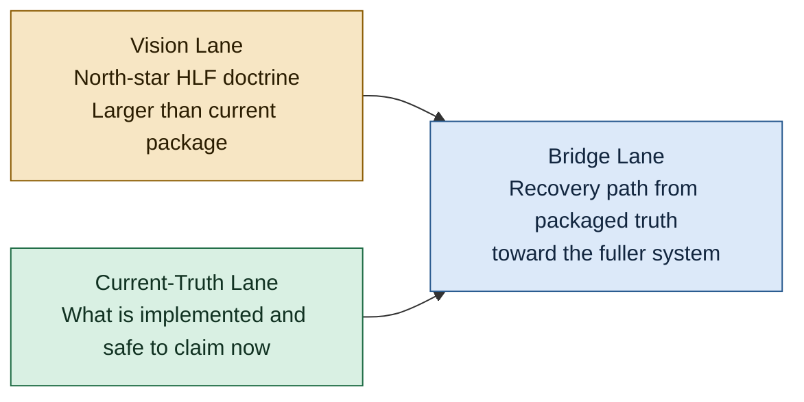

Quick reading guide for first-time readers:

| If you want... | Read this first | Then read |
| --- | --- | --- |
| the big idea | `docs/HLF_VISION_PLAIN_LANGUAGE.md` | `HLF_VISION_DOCTRINE.md` |
| the strict current truth | `SSOT_HLF_MCP.md` | `BUILD_GUIDE.md` |
| the recovery path | `plan/architecture-hlf-reconstruction-2.md` | `HLF_ACTIONABLE_PLAN.md` |
| the wording discipline | `docs/HLF_CLAIM_LANES.md` | `docs/HLF_MCP_POSITIONING.md` |

For a broader document map after that first pass, use `HLF_IMPLEMENTATION_INDEX.md`, `HLF_SOURCE_EXTRACTION_LEDGER.md`, `HLF_SUPPORTIVE_SOURCE_CONTEXT_MAP.md`, and `docs/HLF_DOCTRINE_TEST_COVERAGE_MATRIX.md`.

For branch-aware public review and PR reading, use:

- `docs/claims-ledger.html`
- `docs/HLF_BRANCH_AWARE_CLAIMS_LEDGER_2026-03-20.md`
- `docs/HLF_MERGE_READINESS_SUMMARY_2026-03-20.md`
- `docs/HLF_REVIEWER_HANDOFF_2026-03-20.md`
- `docs/HLF_STATUS_OVERVIEW.md`
- `docs/index.html`

For the merged GitHub Pages status surface, use:

- `docs/HLF_STATUS_OVERVIEW.md`
- `docs/index.html`
- `docs/merge-readiness.html`
- `docs/claims-ledger.html`

Repository boundary:

- `hlf_mcp/` is the packaged product surface and the main implementation line.
- `hlf/` is a retained compatibility and support layer with useful legacy and bridge assets.
- `hlf_source/` is preserved source context and reconstruction evidence from the broader Sovereign system.

HLF is not supposed to stay a neat MCP wrapper.
It is supposed to become a governed language and coordination substrate that connects intent, tools, memory, policy, execution, and human-readable trust.
This repo already contains real parts of that system, and the rest has to be recovered rather than explained away.

Bridge execution note:

- `plan/architecture-hlf-reconstruction-2.md` is the master reconstruction sequencing artifact.
- `docs/HLF_DOCTRINE_TEST_COVERAGE_MATRIX.md` is the current bridge artifact for mapping doctrine pillars to actual regression proof.
- `docs/HLF_RECURSIVE_BUILD_STORY.md` is the canonical explanation of why the recursive-build lane matters and how it should be interpreted.
- `docs/HLF_MESSAGING_LADDER.md` is the audience-specific phrasing guide derived from that canonical explanation.
- the first credible recursive build story is local and bounded: packaged HLF assisting packaged HLF through `stdio`, `hlf_do`, `hlf_test_suite_summary`, and build-observation surfaces; remote `streamable-http` self-hosting stays gated until MCP initialize succeeds end to end.

## Why This Repo Stands Out

HLF is not only meant to be useful after the system is finished.
It is being shaped into a governed language and coordination layer that can already help inspect state, summarize regressions, explain intended actions, and preserve evidence during parts of its own build and recovery process.

That does not mean full self-hosting is complete.
It means the repo already contains a bounded, inspectable proof that construction, operation, and audit can begin to converge inside the same governed system.

The current honest milestone is local and bounded build assistance first.

- `stdio` and local workflows matter because they are the first credible proof lane
- `hlf_do`, `_toolkit.py status`, `hlf_test_suite_summary`, and audit surfaces matter because they already support that loop
- transport gating still matters because stronger claims should only follow stronger proof

That is why this repo's build story is part of its product evidence, not just background process.

For the full version of that claim, read `docs/HLF_RECURSIVE_BUILD_STORY.md`. For audience phrasing rules, read `docs/HLF_MESSAGING_LADDER.md`.

## For Agents And Builders

If you are evaluating this repo as an agent user, builder, or operator, the right mental model is:

- HLF is the governed meaning and coordination substrate
- the packaged MCP server is the main present-tense product surface

What that means in practice:

- today, the packaged MCP surface is already a real governed interface for compile, validate, execute, translate, explain, inspect, and memory-facing work
- for builders, that same surface is the first stable lane for bounded recursive build assistance
- for agents, the target is not just better tool access, but a governed environment where intent, effect boundaries, memory, coordination, and explanation stay linked

What it does **not** mean:

- MCP by itself is not the full meaning layer
- transport availability is not the same thing as architectural completion
- the current packaged surface does not yet restore every constitutive HLF pillar

So the clean position is:

**the MCP server is the right front door, the right current product lane, and the right bootstrap surface for HLF now, while the larger HLF vision remains bigger than MCP in semantics, governance, memory, coordination, trust, and execution.**

For the full doctrinal version of that distinction, read `docs/HLF_MCP_POSITIONING.md`.

MCP front-door view:
the shipped MCP surface is the entry lane, not the full ontology of the system.

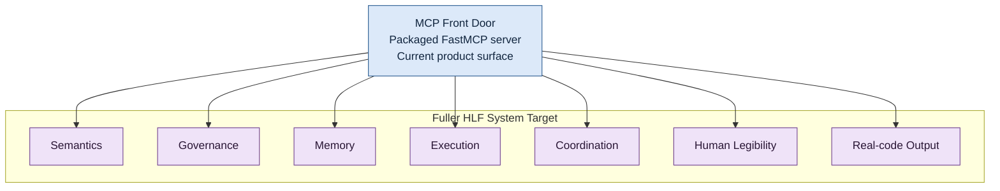

Constitutive pillars view:
these are the major surfaces the repo is trying to hold together rather than collapse into a parser-only or MCP-only story.

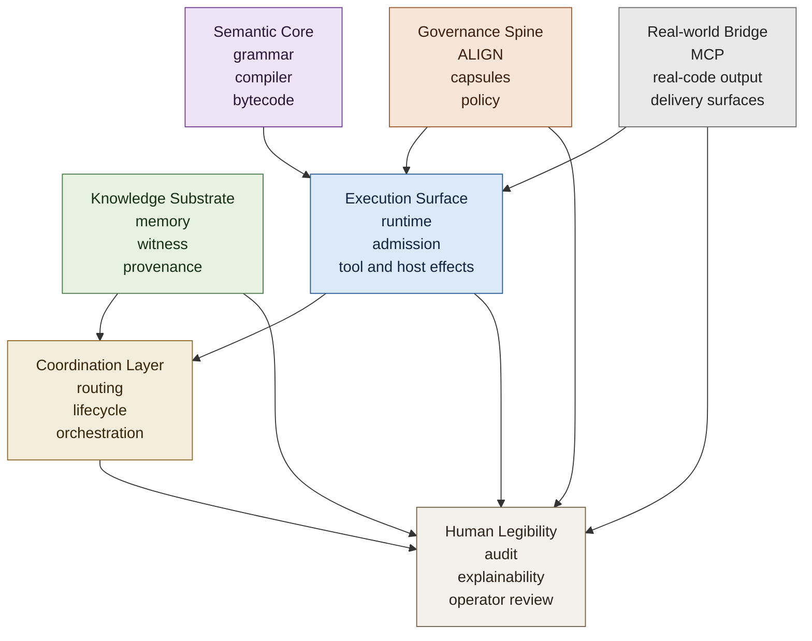

Reading rule:

- this is the shape of the system target, not a claim that every pillar is equally complete now
- the packaged repo already has real pieces in each area, but not every pillar is equally restored
- the bridge work exists to prevent any one pillar from pretending to be the whole system

Compact status legend:

- `present` = real packaged current-truth surface exists now
- `partial` = packaged surface exists, but bridge recovery or proof work is still required
- `source-only` = constitutive upstream authority exists, but the packaged repo does not yet honestly claim full restoration

Quick read of the pillars map under current repo conditions:

- semantic core: `present`
- governance spine: `present` to `partial`, depending on which control surface you mean
- knowledge substrate and memory governance: `partial`
- execution surface: `present` to `partial`
- coordination layer: `partial`
- human legibility: `partial`
- real-world bridge: `present`

Visual guide:
the recursive-build story is strongest when read as a proof ladder rather than a slogan.

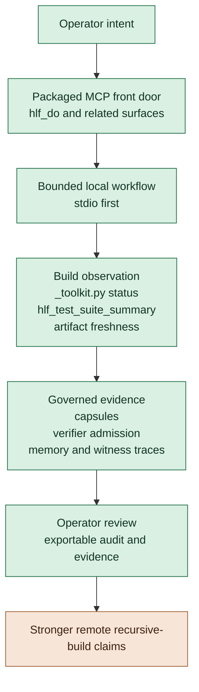

Reading rule:

- the lower rungs are already meaningful current-truth or bridge-backed workflow surfaces
- the ladder does not mean the repo is basic; it means stronger claims are earned in sequence
- the top rung remains gated until remote MCP initialization and the intended smoke path are proven repeatably in the packaged workflow

## Table of Contents

1. What is HLF?
    - Ethos - People First, Transparent Governance
2. Quick Start
3. Architecture Overview
4. Grammar and Language Reference
5. Compiler Pipeline (5 Passes)
6. Bytecode VM
7. Intent Capsule Tier Model
8. Host Function Registry
9. Stdlib - 8 Complete Modules
10. HLF Knowledge Substrate (HKS)
11. Instinct SDD Lifecycle
12. [MCP Server & Transports](#12-mcp-server--transports)
13. [MCP Tools Reference](#13-mcp-tools-reference)
14. [Docker Deployment](#14-docker-deployment)

## Operator Evidence Review

The packaged CLI includes `hlf-evidence` for reviewing governed weekly artifacts.

Useful commands:

```bash
uv run hlf-evidence list --status promoted
uv run hlf-evidence show weekly_demo
uv run hlf-evidence show weekly_demo --json
```

Operator-facing `show` output is intentionally different from raw JSON. When a governed review is attached, the plain-text view exposes the persona handoff contract directly, including change class, owner persona, review personas, required gates, escalation target, operator summary, and the handoff template reference.

See `docs/cli-tools.md` for the command reference.
15. [Benchmark Results](#15-benchmark-results)
16. [Governance & Security](#16-governance--security)
17. [Development](#17-development)
18. [Roadmap](#18-roadmap)

---

## 1. What is HLF?

HLF is not just another DSL and it is not just the current MCP server.

HLF is the attempt to build a governed meaning layer between human intent and machine action: a language that lets agents coordinate, tools execute, memory persist, policy constrain, and humans inspect what is happening in plain terms.

The current MCP server matters because it is the easiest adoption path.
But the larger target is a real language and runtime for governed agent work.

```hlf
[HLF-v3]
Δ analyze /security/seccomp.json
  Ж [CONSTRAINT] mode="ro"
  Ж [EXPECT] vulnerability_shorthand
  ⨝ [VOTE] consensus="strict"
Ω
```

In other words:
the front door is present-tense product truth, while the fuller HLF system remains the larger architectural target.

### Core Properties

| Property | Mechanism |
| --- | --- |
| **Deterministic Intent** | LALR(1) parsing — 100% reproducible execution paths, zero ambiguity |
| **Token Compression** | 12–30% vs NLP prose; up to 83% vs verbose JSON (tiktoken cl100k_base) |
| **Cryptographic Governance** | SHA-256 / Merkle-chain audit trail on every intent and memory write |
| **Gas Metering** | Hard execution budget — every opcode deducts gas, preventing runaway loops |
| **Cross-Model Alignment** | Any LLM (local or cloud) can read and emit valid HLF without special training |
| **Zero-Trust Execution** | Intent Capsules bound what each agent tier can read, write, and call |

### The 5-Surface Language

HLF programs exist in five interchangeable, round-trippable representations:

```text
Glyph Source  ──compile──▶  JSON AST  ──codegen──▶  .hlb Bytecode
     ▲                          │                         │
     │ hlffmt                   │ insaits                 │ disassemble
     │                          ▼                         ▼
ASCII Source            English Audit             Assembly Listing
```

### Ethos — People First, Transparent Governance

- People and their work are the priority; privacy is default, and HLF enforces hard laws rather than paternalistic filters.
- AI is the tool — humans author the constraints, which stay transparent and auditable in-repo.
- Ethical Governor enforces hard laws at compile time: fails closed before harm, supports declared red-hat research paths, and cryptographically documents every decision.
- Transparency over surveillance: governance files (ALIGN rules, ethics docs) stay human-readable so constraints can be inspected and debated.
- Use HLF freely; when boundaries apply, they are explicit, scoped to protect people, and never to suppress legitimate research or creativity.

**Security Responsibility:** While HLF and the MCP enforce strong, auditable boundaries, not all security risks can be mitigated at the protocol or software level. Users are responsible for their own operational security, including (but not limited to) using a trusted VPN, maintaining a reputable local security suite (e.g., Bitdefender or equivalent), and following best practices for endpoint protection. The project ethos is to empower, not to guarantee; ultimate safety is a shared responsibility between the system and its operators.

See `docs/ETHICAL_GOVERNOR_HANDOFF.md` for the handoff brief guiding the downstream ethics module implementation.

### The Arrival Analogy — Why Symbols Beat Sentences

If you've seen the film *Arrival*, you know the premise: alien visitors communicate through circular logograms where a single symbol encodes an entire proposition — subject, verb, object, tense, causality, and intent — all at once. A human sentence like *"We offer a weapon"* takes four tokens; a heptapod logogram captures the full meaning, its negation, its conditions, and its consequences in one non-linear glyph. The linguist doesn't learn a language — she learns a **new way of thinking about meaning**, where time and intent are not sequential but simultaneous.

HLF is that idea, made real, for AI agents.

When a human writes `"Audit /security/seccomp.json, read-only, and report vulnerabilities"`, that is a **linear, ambiguous, high-entropy** sentence. Different LLMs will parse it differently. Context is lost between tokens. There is no formal guarantee of what "read-only" means or whether "report" implies file-write permission.

When HLF compresses that into:

```hlf
[HLF-v3]
Δ [INTENT] goal="audit_seccomp"
  Ж [CONSTRAINT] mode="ro"
  Ж [EXPECT] vulnerability_shorthand
  ⨝ [VOTE] consensus="strict"
Ω
```

...every ambiguity is resolved **mathematically**. `Ж [CONSTRAINT] mode="ro"` is not a suggestion — it is a hard, compiler-enforced, gas-metered boundary. The `⨝ [VOTE]` node requires consensus before the result is accepted. The `Ω` terminator seals the intent for Merkle-chain audit. Every symbol has a precise semantic role, a defined gas cost, and a cryptographic hash.

Like heptapod logograms, HLF glyphs are **non-linear propositions**: a single symbol encodes the what (intent), the how (constraints), the who (tier), the how-much (gas), and the proof (audit trail) — all simultaneously. The mathematics underneath — Shannon entropy for compression, KL divergence for disambiguation, confidence thresholds for quality gating — are what make this reliable instead of clever.

The front door is English. The engine is math. The glyphs are the bridge.

For the full architectural vision including the 13-layer Three-Brain model, Rosetta Engine (Deterministic Compilation Equivalence), EnCompass (Probabilistic Angelic Nondeterminism), ROMA orchestration, and Darwin Gödel Machine evolution, see the [Sovereign Agentic OS README](https://github.com/Grumpified-OGGVCT/Sovereign_Agentic_OS_with_HLF#readme) — particularly the upgrade suggestions in the final sections covering layered profiles, formal effect systems, 5-surface round-tripping, and the 90-day roadmap from "interesting system" to "planet-class language."

---

## 2. Quick Start

### Option A — Docker (recommended for any agent)

```bash
# SSE transport (remote agents, web clients)
docker run -e HLF_TRANSPORT=sse -e HLF_PORT=<explicit-port> -p <explicit-port>:<explicit-port> ghcr.io/grumpified-oggvct/hlf-mcp:latest

# Streamable-HTTP transport (modern MCP clients)
docker run -e HLF_TRANSPORT=streamable-http -e HLF_PORT=<explicit-port> -p <explicit-port>:<explicit-port> ghcr.io/grumpified-oggvct/hlf-mcp:latest

# stdio transport (Claude Desktop, local agents)
docker run -i -e HLF_TRANSPORT=stdio ghcr.io/grumpified-oggvct/hlf-mcp:latest
```

For HTTP transports, choose and set the port explicitly. The packaged server no longer treats `8000` as an implied default for `sse` or `streamable-http`.

These transport examples show packaged runtime availability.
They do not by themselves promote recursive-build maturity claims.

**Endpoints when SSE is active:**

| Path | Purpose |
| --- | --- |
| `GET /sse` | SSE event stream (MCP handshake) |
| `POST /messages/` | MCP message endpoint |
| `GET /health` | Health check (returns `{"status":"ok"}`) |

### Option B — Local install

```bash
# 1. Install with uv (Python ≥ 3.12 required)
uv sync

# 2. Compile and run a fixture
uv run hlfc fixtures/security_audit.hlf
uv run hlfrun fixtures/hello_world.hlf

# 3. Start MCP server on an explicit chosen SSE port
HLF_TRANSPORT=sse HLF_PORT=<explicit-port> uv run hlf-mcp
```

For unfamiliar agents or operators, use `docs/HLF_AGENT_ONBOARDING.md` before working from `hlf/` or `hlf_source/` directly.

### Option C — Docker Compose (full stack)

```bash
HLF_PORT=<explicit-port> docker compose up -d
# MCP SSE server → http://localhost:$HLF_PORT/sse
# Health check  → http://localhost:$HLF_PORT/health
```

Current proof boundary for recursive-build claims:

- `stdio` is still the first credible build-assist lane
- SSE and `streamable-http` remain useful transport surfaces and bring-up targets
- do not treat remote `streamable-http` as the center of the recursive-build story until end-to-end MCP initialization is proven in the packaged workflow

### Claude Desktop (`claude_desktop_config.json`)

```json
{
  "mcpServers": {
    "hlf": {
      "command": "docker",
      "args": ["run", "-i", "--rm", "-e", "HLF_TRANSPORT=stdio",
               "ghcr.io/grumpified-oggvct/hlf-mcp:latest"]
    }
  }
}
```

---

## 3. Architecture Overview

This architecture view shows the packaged transport and server surface.
It should not be read as promoting `streamable-http` into recursive-build proof by transport presence alone.

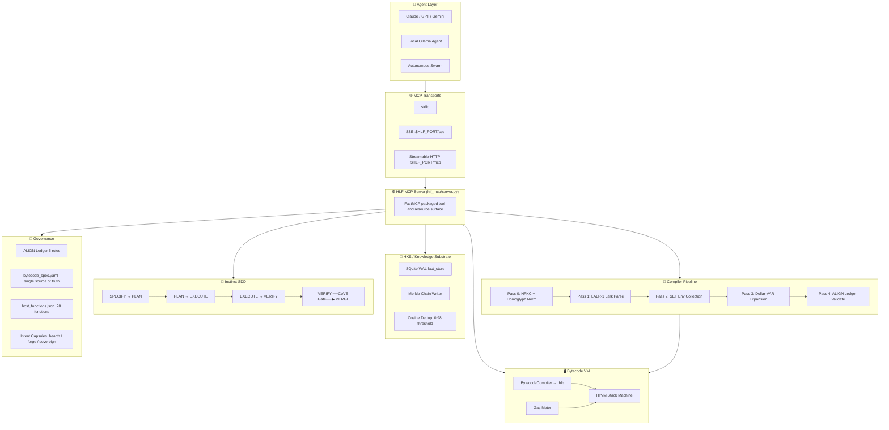

---

## 4. Grammar & Language Reference

### The 7 Hieroglyphic Glyphs

Glyph statements begin with one of seven Unicode glyphs. HLF also supports keyword-led statements such as `SET`, `ASSIGN`, `IF`, `FUNCTION`, `TOOL`, `CALL`, `IMPORT`, and the Instinct spec forms. The table below shows the current packaged glyph set and the current packaged bytecode lowering used by the compiler:

| Glyph | Name | Semantic Role | ASCII Alias | Opcode |
| --- | --- | --- | --- | --- |
| `Δ` | DELTA | Analyze / primary action | `ANALYZE` | `0x51` (`CALL_HOST`) |
| `Ж` | ZHE | Enforce / constrain / assert | `ENFORCE` | `0x60` (`TAG`) |
| `⨝` | JOIN | Consensus / join / vote | `JOIN` | `0x61` (`INTENT`) |
| `⌘` | COMMAND | Command / delegate / route | `CMD` | `0x51` (`CALL_HOST`) |
| `∇` | NABLA | Source / parameter / data flow | `SOURCE` | `0x01` (`PUSH_CONST`) |
| `⩕` | BOWTIE | Priority / weight / rank | `PRIORITY` | `0x60` (`TAG`) |
| `⊎` | UNION | Branch / condition / union | `BRANCH` | `0x41` (`JZ`) |

### Statement Types (21 total)

```text
glyph_stmt   — Δ/Ж/⨝/⌘/∇/⩕/⊎ [TAG] key="val" ...
assign_stmt  — ASSIGN name = expr       (mutable binding)
set_stmt     — SET name = expr          (immutable binding)
if_block_stmt — IF expr { ... } ELIF expr { ... } ELSE { ... }
if_flat_stmt — IF expr => stmt
for_stmt     — FOR name IN expr { ... }
parallel_stmt — PARALLEL { ... } { ... }
func_block_stmt — FUNCTION name(args) { ... }
intent_stmt  — INTENT name key="val" { ... }
tool_stmt    — TOOL name key="val"
call_stmt    — CALL name(args)
return_stmt  — RETURN value?
result_stmt  — RESULT code msg?
log_stmt     — LOG "message"
import_stmt  — IMPORT module_name
memory_stmt  — MEMORY entity confidence="0.9" content="..."
recall_stmt  — RECALL entity top_k=5
spec_define_stmt — SPEC_DEFINE name key="val"
spec_gate_stmt — SPEC_GATE name key="val"
spec_update_stmt — SPEC_UPDATE name key="val"
spec_seal_stmt — SPEC_SEAL name
```

Bridge note: the current packaged grammar is real and usable now, but the long-term HLF language target is larger than this syntax inventory alone and will need stronger canonical surface discipline across glyph, ASCII, AST, bytecode, and audit/decompilation forms.

### Canonical Tags

```hlf
INTENT  CONSTRAINT  ASSERT  EXPECT  DELEGATE  ROUTE  SOURCE
PARAM   PRIORITY    VOTE    RESULT  MEMORY    RECALL
GATE    DEFINE      MIGRATION  ALIGN
```

### Expression Precedence (low → high)

```text
_expr   (20) : ==  !=  <  >  <=  >=  AND  OR
_term   (30) : +  -
_factor (40) : *  /  %
_unary  (50) : NOT  -  (unary negation)
_atom        : string · int · float · bool · $VAR · ${VAR} · ident · path
```

### Program Structure

```hlf
[HLF-v3]          ← header: version declaration
<statements>       ← body: one or more statements
Ω                  ← omega terminator (required)
```

### Type Annotations (`TYPE_SYM`)

```text
𝕊  — string    ℕ  — integer    𝔹  — boolean    𝕁  — JSON    𝔸  — any
```

### Example Programs

#### Hello World

```hlf
# HLF v3 — Hello World
[HLF-v3]
Δ [INTENT] goal="hello_world"
    Ж [ASSERT] status="ok"
    ∇ [RESULT] message="Hello, World!"
Ω
```

#### Security Baseline Audit (Sentinel Mode)

```hlf
# HLF v3 — Security Baseline Audit
[HLF-v3]
Δ analyze /security/seccomp.json
    Ж [CONSTRAINT] mode="ro"
    Ж [EXPECT] vulnerability_shorthand
    ⨝ [VOTE] consensus="strict"
Ω
```

#### Multi-Agent Task Delegation (Orchestrator Mode)

```hlf
# HLF v3 — Multi-Agent Task Delegation
[HLF-v3]
⌘ [DELEGATE] agent="scribe" goal="fractal_summarize"
    ∇ [SOURCE] /data/raw_logs/matrix_sync_2026.txt
    ⩕ [PRIORITY] level="high"
    Ж [ASSERT] vram_limit="8GB"
Ω
```

#### Real-Time Resource Mediation (MoMA Router)

```hlf
# HLF v3 — MoMA Router
[HLF-v3]
⌘ [ROUTE] strategy="auto" tier="${DEPLOYMENT_TIER}"
    ∇ [PARAM] temperature=0.0
    Ж [VOTE] confirmation="required"
Ω
```

---

## 5. Compiler Pipeline (5 Passes)

The diagram below summarizes the five named compiler passes. The current packaged compile path also includes the ethics governor hook, gas estimation, and AST caching around those named passes.

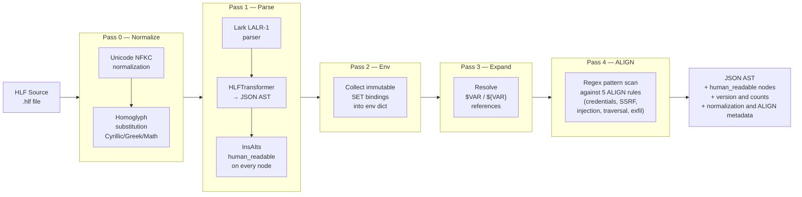

### Homoglyph Confusables (Pass 0)

Pass 0 prevents **IDN homograph attacks** — where a visually identical Cyrillic `а` replaces Latin `a` to smuggle unexpected behaviour through the parser:

| Category | Example substitutions |
| --- | --- |
| Cyrillic | `а→a` `е→e` `о→o` `р→p` `с→c` `х→x` `у→y` |
| Greek | `α→a` `ε→e` `ο→o` `ρ→p` `σ→s` |
| Math operators | `−→-` `×→*` `÷→/` `≠→!=` `≤→<=` `≥→>=` |

Bridge note: the packaged compiler already enforces a real deterministic pipeline, but the bridge to fuller HLF completion requires stronger conformance surfaces, round-trip proof, and tighter spec-to-implementation canonicality than a pass diagram alone can show.

---

## 6. Bytecode VM

### Binary Format (`.hlb`)

```text
Offset  Size   Field
──────  ─────  ────────────────────────────────────────────
0       32     SHA-256 manifest hash (integrity guard)
32      4      Magic bytes: "HLB\x00"
36      2      Format version (0x0004 = v0.4)
38      4      Code section length (little-endian uint32)
42      4      CRC32 checksum of code section
46      2      Flags (reserved, must be 0)
48      ...    Constant pool (typed entries)
48+n    ...    Code section (3-byte fixed instructions)
```

### Instruction Format

Every instruction is exactly **3 bytes**:

```text
[opcode: 1 byte] [operand: 2 bytes little-endian]
```

### Opcode Table (37 opcodes)

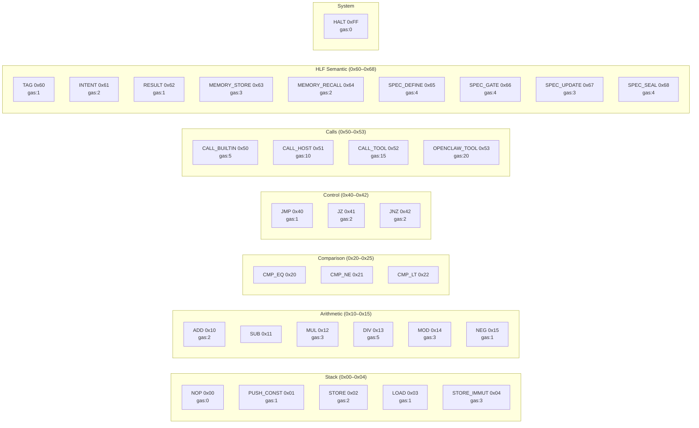

> **Opcode conflict fixed**: `OPENCLAW_TOOL` was previously at `0x65`, conflicting with the Instinct spec opcodes. It is now at `0x53`. The `governance/bytecode_spec.yaml` file is the **single source of truth**. The current packaged code is aligned to that spec; it is not yet fully generated from it.

### Constant Pool Encoding

```text
Type   Byte   Encoding
─────  ─────  ──────────────────────────────
INT    0x01   <Bq>  little-endian signed 64-bit
FLOAT  0x02   <Bd>  IEEE-754 double
STRING 0x03   <BI><UTF-8 bytes>  length-prefixed
BOOL   0x04   <BB>  0x00=false / 0x01=true
NULL   0x05   <B>   no payload
```

### Gas Model

| Tier | Gas Limit | Use Case |
| --- | --- | --- |
| `hearth` | 100 | Untrusted / minimal agents |
| `forge` | 500 | Standard agents |
| `sovereign` | 1000 | Trusted orchestrators |
| `CALL_HOST` | from registry | Actual gas from `host_functions.json` |
| `CALL_TOOL` | 15 (base) | Registered tool calls |
| `OPENCLAW_TOOL` | 20 | Sandboxed external tools |

The VM meters gas **before** each dispatch. On budget breach it raises `HlfVMGasExhausted` immediately — no partial execution.

Bridge note: the current bytecode/runtime contract is real and auditable now, but fuller completion still requires stronger spec-driven generation, conformance testing, and proof that runtime behavior preserves canonical HLF meaning across all surfaces.

---

## 7. Intent Capsule Tier Model

Intent Capsules bound what each agent tier can read, write, and call — enforced at both static (pre-flight AST check) and dynamic (runtime) levels.

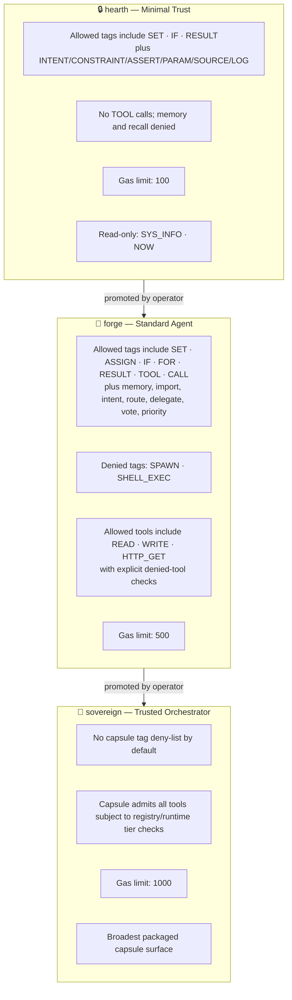

### Capsule Pre-Flight Validation

Before any VM execution, the capsule checks the AST statically:

1. **Tag whitelist/blacklist** — denied tags raise `CapsuleViolation` before the first instruction runs
2. **Tool whitelist/blacklist** — explicit tool/call surfaces are checked against `allowed_tools` / `denied_tools`
3. **Read-only variable guard** — `SET` and `ASSIGN` to protected vars such as `SYS_INFO` and, in `hearth`, `NOW` are blocked
4. **Gas budget** — cumulative gas from capability use is checked against `max_gas`

Bridge note: capsules already provide real bounded-admission behavior, but the larger HLF target requires a richer formal effect and approval model than the current tier explainer captures.

---

## 8. Host Function Registry

32 host functions are defined in `governance/host_functions.json`. Each has `tier`, `gas`, `backend`, and `sensitive` fields enforced at runtime. The table below is a representative subset of the current packaged registry surface:

| Function | Tiers | Gas | Backend | Sensitive |
| --- | --- | --- | --- | --- |
| `READ` | all | 1 | `dapr_file_read` | ✗ |
| `WRITE` | all | 2 | `dapr_file_write` | ✗ |
| `SPAWN` | forge, sovereign | 5 | `docker_orchestrator` | ✗ |
| `SLEEP` | all | 0 | `builtin` | ✗ |
| `HTTP_GET` | forge, sovereign | 3 | `dapr_http_proxy` | ✗ |
| `HTTP_POST` | forge, sovereign | 4 | `dapr_http_proxy` | ✗ |
| `WEB_SEARCH` | forge, sovereign | 5 | `dapr_http_proxy` | ✓ |
| `analyze` | all | 3 | `native_bridge` | ✗ |
| `hash_sha256` | all | 1 | `builtin` | ✗ |
| `merkle_chain` | all | 2 | `builtin` | ✗ |
| `log_emit` | all | 1 | `builtin` | ✗ |
| `assert_check` | all | 1 | `builtin` | ✗ |
| `memory_store` | all | 3 | `rag_memory` | ✗ |
| `memory_recall` | all | 2 | `rag_memory` | ✗ |
| `vote` | forge, sovereign | 2 | `native_bridge` | ✗ |
| `delegate` | forge, sovereign | 4 | `native_bridge` | ✗ |
| `route` | forge, sovereign | 3 | `native_bridge` | ✗ |
| `get_timestamp` | all | 0 | `builtin` | ✗ |
| `generate_ulid` | all | 0 | `builtin` | ✗ |
| `compress_tokens` | all | 2 | `builtin` | ✗ |
| `summarize` | forge, sovereign | 10 | `zai_client` | ✗ |
| `embed_text` | forge, sovereign | 5 | `zai_client` | ✗ |
| `cosine_similarity` | all | 2 | `builtin` | ✗ |
| `cove_validate` | all | 5 | `native_bridge` | ✗ |
| `align_verify` | all | 2 | `builtin` | ✗ |
| `z3_verify` | sovereign | 20 | `z3_native` | ✗ |
| `get_vram` | forge, sovereign | 1 | `native_bridge` | ✗ |
| `get_tier` | all | 0 | `builtin` | ✗ |

> **Sensitive outputs**: Functions with `sensitive=true` never log raw return values — only a `SHA-256[:16]` prefix is written to audit logs.

Bridge note: the registry is already a real capability contract, but fuller HLF completion needs a stronger effect schema with clearer determinism, idempotence, and backend-portability semantics than the current README subset can express.

---

## 9. Stdlib — 8 Complete Modules

All eight stdlib modules listed here are implemented in the packaged runtime with no obvious placeholder stubs. “Complete” here means implemented now, not semantically finished relative to the larger HLF language target. They are importable in HLF via `IMPORT module_name` and callable as `module_name.FUNCTION(args)`.

| Module | Key Functions |
| --- | --- |
| `agent` | `AGENT_ID`, `AGENT_TIER`, `AGENT_CAPABILITIES`, `SET_GOAL`, `GET_GOALS`, `COMPLETE_GOAL` |
| `collections` | `LIST_LENGTH/APPEND/CONCAT/FILTER/MAP/REDUCE`, `DICT_GET/SET/KEYS/VALUES` |
| `crypto` | `ENCRYPT` (AES-256-GCM), `DECRYPT`, `KEY_GENERATE`, `KEY_DERIVE` (PBKDF2-HMAC-SHA256 600K iter), `SIGN/SIGN_VERIFY` (HMAC-SHA256), `HASH/HASH_VERIFY`, `MERKLE_ROOT`, `MERKLE_CHAIN_APPEND` |
| `io` | `FILE_READ/WRITE/EXISTS/DELETE`, `DIR_LIST/CREATE`, `PATH_JOIN/BASENAME/DIRNAME` (all ACFS-confined) |
| `math` | `MATH_ABS/FLOOR/CEIL/ROUND/MIN/MAX/POW/SQRT/LOG/SIN/COS/TAN/PI/E` |
| `net` | `HTTP_GET/POST/PUT/DELETE`, `URL_ENCODE/DECODE` |
| `string` | `STRING_LENGTH/CONCAT/SPLIT/JOIN/UPPER/LOWER/TRIM/REPLACE/CONTAINS/STARTS_WITH/ENDS_WITH/SUBSTRING` |
| `system` | `SYS_OS/ARCH/CWD/ENV/SETENV/TIME/SLEEP/EXIT/EXEC` |

### Crypto Module — AES-256-GCM (No Stubs)

```python
# ENCRYPT: random 12-byte nonce, AES-256-GCM, returns base64(nonce + GCM-tag + ciphertext)
result = crypto.ENCRYPT(plaintext, key_b64)

# DECRYPT: authenticates GCM tag before releasing plaintext — fails on tamper
plain  = crypto.DECRYPT(ciphertext_b64, key_b64)

# KEY_DERIVE: PBKDF2-HMAC-SHA256, 600,000 iterations (OWASP 2024 recommendation)
key    = crypto.KEY_DERIVE(password, salt_b64)

# MERKLE_ROOT: SHA-256 binary tree — lossless round-trip from AST
root   = crypto.MERKLE_ROOT(["leaf1", "leaf2", "leaf3"])
```

Bridge note: the packaged stdlib is already materially useful, but the long-range HLF language surface will need stronger typing, effect semantics, package/version discipline, and broader governed language capabilities than the current stdlib summary alone implies.

---

## 10. HLF Knowledge Substrate (HKS)

The HLF Knowledge Substrate, or HKS, is the repo's governed knowledge system.
HKS can tap into Infinite RAG where persistent memory and retrieval are needed, but they are separate in scope.
Infinite RAG is its own memory subsystem and engine.
HKS is the broader governed knowledge layer for exemplars, provenance, weekly evidence, operator-reviewable recall, and knowledge-promotion contracts across sessions.

Current packaged truth:

- Infinite RAG persistence and recall are real
- HKS exemplar capture and recall surfaces are real
- Weekly HKS artifact-integration hooks are real
- provenance-bearing memory nodes and Merkle-linked lineage are real
- MCP memory-facing tools are real
- broader freshness, trust-tier, supersession, weekly evidence, and fuller HKS contracts remain bridge work

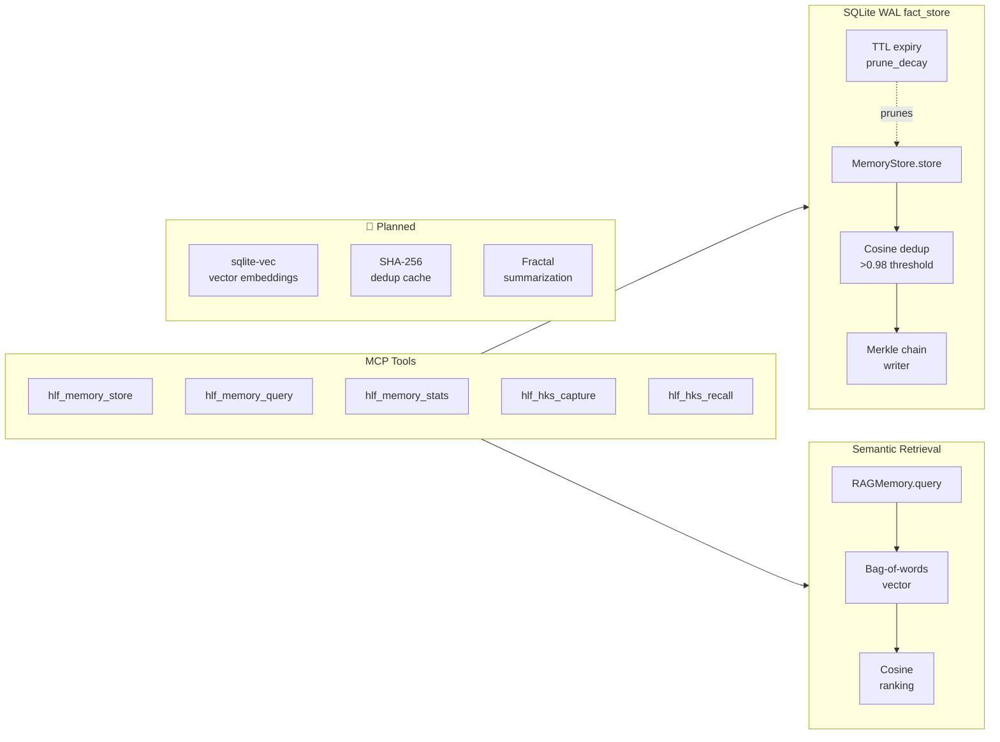

### HKS Properties

| Property | Implementation |
| --- | --- |
| **Infinite RAG integration** | HKS can use the packaged Infinite RAG subsystem for persisted memory and retrieval |
| **Cosine dedup** | Bag-of-words cosine similarity; nodes with similarity `>0.98` rejected as duplicates |
| **Provenance lineage** | Every write appends a SHA-256 chain link for forensic audit and replayable evidence |
| **TTL expiry** | `prune_decay()` removes entries past their TTL |
| **Entity indexing** | Per-entity namespace; `query(entity, text, top_k)` returns ranked results |
| **Tag indexing** | Entries tagged for cross-entity retrieval |
| **Knowledge substrate role** | HKS governs exemplar capture, recall, provenance, and evidence promotion rather than acting as a generic memory bucket |

### HKS Scope

HKS in this repo currently spans:

- HKS exemplar capture and governed recall paths
- weekly validated-artifact to HKS exemplar conversion hooks
- provenance-bearing knowledge objects and evidence summaries
- integration points with Infinite RAG persistence and retrieval
- governed memory nodes with provenance fields and TTL behavior
- memory-facing MCP tools for store, query, stats, and HKS exemplar flows
- witness and audit-adjacent evidence flow in the broader memory/governance lane

HKS is intended to converge toward a richer governed substrate carrying freshness, confidence, trust-tier semantics, supersession, revocation, weekly knowledge ingest, and operator-legible evidence contracts.

### HLF ↔ HKS Synergy

| Without HLF | With HLF |
| --- | --- |
| RAG ingests verbose NLP → bloated store | RAG ingests compressed HLF ASTs → smaller, denser entries |
| Context window fills quickly | HLF intents are 12–30% smaller → more facts per prompt |
| Cross-agent sharing is prose-ambiguous | Agents share typed, deterministic HLF → exact semantic match |
| Dream State compresses NLP → lossy | Dream State compresses HLF AST → lossless (round-trips) |
| No governed knowledge contract | Packaged HKS already adds provenance, exemplar capture, and evidence-aware memory flows; fuller write-gating and trust semantics remain bridge work |

Bridge note: HKS is already more than a generic memory bucket in this checkout, but the intended governed knowledge substrate is still larger than the current packaged persistence, exemplar, and weekly-evidence surfaces.

---

## 11. Instinct SDD Lifecycle

Every mission tracked through the packaged Instinct lifecycle follows the deterministic **Specify → Plan → Execute → Verify → Merge** path. Phase skips and backward transitions are blocked. The CoVE gate is mandatory on `VERIFY → MERGE`.

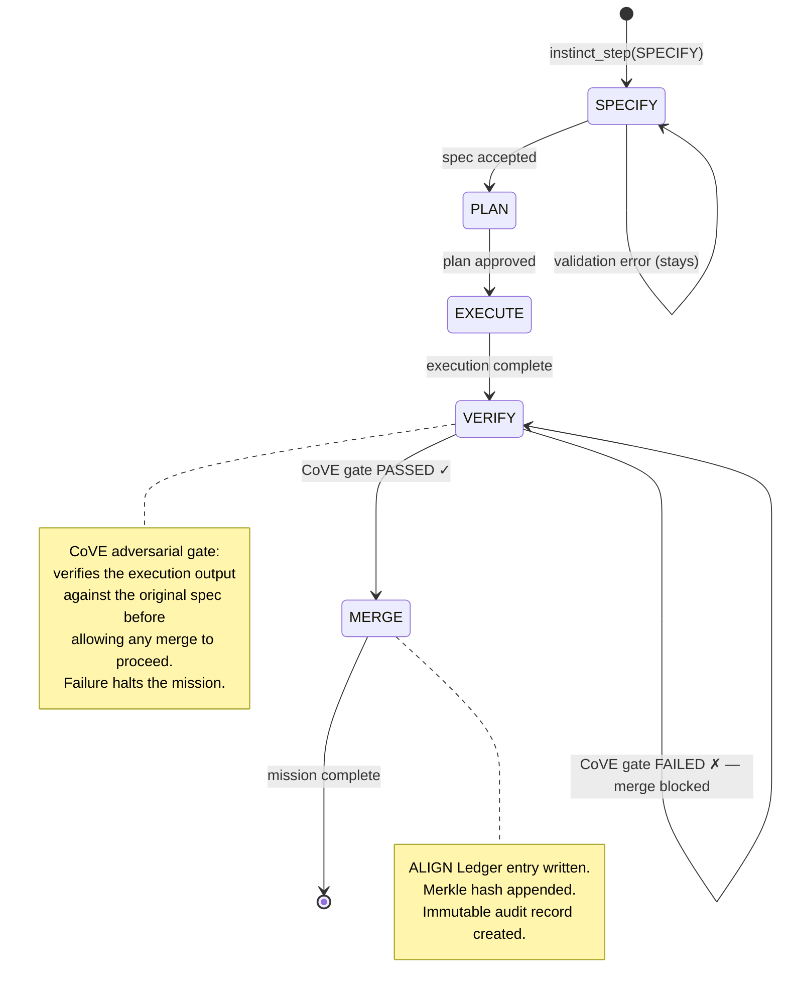

### Lifecycle Rules

- **No phase skips**: Cannot jump from `SPECIFY` to `EXECUTE` — every intermediate phase is required
- **No backward transitions**: A `MERGE`d mission cannot reopen to `EXECUTE`
- **CoVE gate on VERIFY→MERGE**: If `cove_result.get("passed") == False`, the merge transition is blocked and the mission remains at `VERIFY` unless advanced later through the lifecycle
- **ALIGN Ledger logging**: Every phase transition emits a ledger entry with SHA-256 hash and ULID timestamp

Bridge note: the packaged lifecycle already enforces a real deterministic mission path, but the larger HLF coordination target still requires richer orchestration, verification evidence, and cross-agent governance than this lifecycle summary alone covers.

---

## 12. MCP Server & Transports

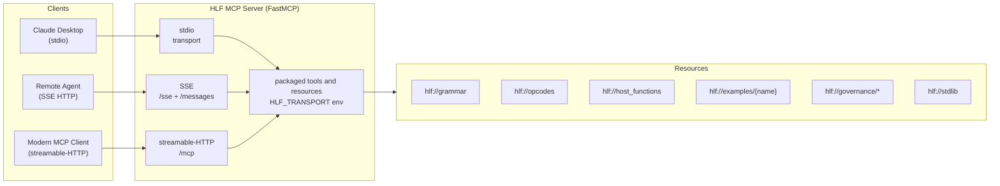

### Transport Configuration

| `HLF_TRANSPORT` | Endpoint | Typical Use |
| --- | --- | --- |
| `stdio` (default) | stdin/stdout | Claude Desktop, local agents |
| `sse` | `GET /sse` + `POST /messages/` | Remote agents, Docker, web clients |
| `streamable-http` | `POST /mcp` | Modern MCP 1.26+ clients; packaged transport availability, not recursive-build proof by itself |

Current proof boundary:

- `stdio` remains the primary current-truth transport for the bounded recursive-build lane
- HTTP transports are real packaged surfaces, but stronger self-hosting claims should remain gated by end-to-end MCP proof rather than transport availability alone

```bash
# Environment variables
HLF_TRANSPORT=sse           # transport type
HLF_HOST=0.0.0.0            # bind address (SSE/HTTP only)
HLF_PORT=<explicit-port>    # required explicit port (SSE/HTTP only)
```

---

## 13. MCP Tools Reference

### Compiler & Analysis Tools

| Tool | Description | Key Parameters |
| --- | --- | --- |
| `hlf_do` | Plain-English front door: intent -> governed HLF -> audit | `intent, tier, dry_run, show_hlf` |
| `hlf_compile` | Parse HLF source → JSON AST + bytecode hex | `source: str` |
| `hlf_format` | Canonicalize: uppercase tags, trailing `Ω` | `source: str` |
| `hlf_lint` | Static analysis: token budget, gas, vars, specs | `source, gas_limit, token_limit` |
| `hlf_validate` | Quick syntax check → `{valid: bool, errors: [...]}` | `source: str` |
| `hlf_run` | Execute in VM, return result + trace | `source, tier, max_gas` |
| `hlf_disassemble` | `.hlb` hex → human-readable assembly | `bytecode_hex: str` |

### Translation & Decompilation

| Tool | Description |
| --- | --- |
| `hlf_translate_to_hlf` | English prose → HLF source (tone-aware) |
| `hlf_translate_to_english` | HLF source → natural language summary |
| `hlf_decompile_ast` | HLF source → structured English docs (AST level) |
| `hlf_decompile_bytecode` | HLF source → bytecode prose + disassembly |
| `hlf_similarity_gate` | Compare two HLF programs for semantic similarity (`cosine ≥ 0.95`) |

### Capsule & Security

| Tool | Description |
| --- | --- |
| `hlf_capsule_validate` | Pre-flight AST check against `hearth`/`forge`/`sovereign` capsule |
| `hlf_capsule_run` | Capsule-sandboxed compile + run (violations caught before VM entry) |
| `hlf_host_functions` | List host functions available for a tier |
| `hlf_host_call` | Directly call a host function from the registry |
| `hlf_tool_list` | List tools from the ToolRegistry |

### Memory & Instinct

| Tool | Description |
| --- | --- |
| `hlf_memory_store` | Store a fact in the Infinite RAG subsystem with pointer and audit metadata |
| `hlf_memory_query` | Query the Infinite RAG subsystem with governed filters for provenance and entry kinds |
| `hlf_hks_capture` | Capture a validated HKS exemplar with provenance, tests, and solution metadata |
| `hlf_hks_recall` | Recall governed HKS exemplars by domain and solution pattern |
| `hlf_memory_stats` | Inspect Infinite RAG stats, including HKS exemplar counts, Merkle chain depth, and topic/domain breakdowns |
| `hlf_instinct_step` | Advance an Instinct SDD lifecycle mission |
| `hlf_instinct_get` | Get current state of an Instinct mission |
| `hlf_spec_lifecycle` | Full SPECIFY→PLAN→EXECUTE→VERIFY→MERGE orchestration |

### Benchmarking

| Tool | Description |
| --- | --- |
| `hlf_benchmark` | Token compression analysis: HLF vs NLP prose |
| `hlf_benchmark_suite` | Run all 7 fixture benchmarks, return full table |

### Resources (read-only)

| URI | Contents |
| --- | --- |
| `hlf://grammar` | Full LALR(1) Lark grammar text |
| `hlf://opcodes` | Bytecode opcode table (37 opcodes) |
| `hlf://host_functions` | Available host function registry |
| `hlf://examples/{name}` | Example: `hello_world`, `security_audit`, `delegation`, `routing`, `db_migration`, `log_analysis`, `stack_deployment` |
| `hlf://governance/host_functions` | Raw `governance/host_functions.json` |
| `hlf://governance/bytecode_spec` | Raw `governance/bytecode_spec.yaml` |
| `hlf://governance/align_rules` | Raw `governance/align_rules.json` |
| `hlf://stdlib` | Stdlib module index with function lists |

---

## 14. Docker Deployment

### Multi-Stage Build

```dockerfile
# Stage 1: builder — installs all deps with uv
FROM python:3.12-slim AS builder
WORKDIR /app
COPY --from=ghcr.io/astral-sh/uv:latest /uv /uvx /bin/
COPY pyproject.toml uv.lock ./
RUN uv sync --frozen --no-dev

# Stage 2: runtime — minimal image, no build tools
FROM python:3.12-slim
COPY --from=builder /app /app
WORKDIR /app
HEALTHCHECK --interval=30s CMD python -c "import os, urllib.request; urllib.request.urlopen('http://localhost:' + os.environ['HLF_PORT'] + '/health')" || exit 1
ENV HLF_TRANSPORT=sse HLF_HOST=0.0.0.0
CMD ["/app/.venv/bin/python", "-m", "hlf_mcp.server"]
```

### docker-compose.yml

```yaml
services:
  hlf-mcp:
    build: .
    ports:
            - "${HLF_PORT:?Set HLF_PORT}:${HLF_PORT:?Set HLF_PORT}"
    environment:
      HLF_TRANSPORT: sse
      HLF_HOST: 0.0.0.0
            HLF_PORT: "${HLF_PORT:?Set HLF_PORT}"
    healthcheck:
            test: ["CMD-SHELL", "python -c \"import os, urllib.request; urllib.request.urlopen('http://localhost:' + os.environ['HLF_PORT'] + '/health')\""]
      interval: 30s
      timeout: 10s
      retries: 3
    restart: unless-stopped
```

### Environment Reference

| Variable | Default | Description |
| --- | --- | --- |
| `HLF_TRANSPORT` | `stdio` | Transport type: `stdio` / `sse` / `streamable-http` |
| `HLF_HOST` | `0.0.0.0` | Bind address for HTTP transports |
| `HLF_PORT` | none | Required port for HTTP transports |

---

## 15. Benchmark Results

Real compression ratios measured with **tiktoken cl100k_base** (OpenAI's tokenizer):

| Domain | NLP Tokens | HLF Tokens | Compression | 5-Agent Swarm Saved |
| --- | --- | --- | --- | --- |
| **Hello World** | 71 | 50 | **29.6%** | 105 tokens |
| **Security Audit** | 105 | 78 | **25.7%** | 135 tokens |
| **Content Delegation** | 115 | 101 | **12.2%** | 70 tokens |
| **Database Migration** | 139 | 122 | **12.2%** | 85 tokens |
| **Log Analysis** | 129 | 120 | **7.0%** | 45 tokens |
| **Stack Deployment** | 104 | 109 | -4.8% | *(overhead)* |
| **Overall** | **663** | **580** | **12.5%** | **415 tokens/cycle** |

```text
Token Compression by Domain
─────────────────────────────────────────────────────────────────
Hello World     [██████████████████████████████ 29.6%]
Security Audit  [█████████████████████████ 25.7%]
Delegation      [████████████ 12.2%]
DB Migration    [████████████ 12.2%]
Log Analysis    [███████ 7.0%]
Stack Deployment[░ -4.8%  (HLF tags add overhead for tiny payloads)]
─────────────────────────────────────────────────────────────────
Overall: 12.5% · In a 5-agent swarm: 415 tokens saved per broadcast cycle
```

> **Note**: Compression increases dramatically with payload complexity. Simple structural tasks like `deploy_stack` show near-parity because HLF's typed tags add overhead that matches NLP verbosity for short payloads. At scale (complex intents + swarm broadcasting), HLF's advantage compounds — 83 tokens saved × 5 agents = **415 tokens per cycle**.

---

## 16. Governance & Security

### ALIGN Ledger (5 Rules)

The ALIGN Ledger runs as Pass 4 in the compiler. Every string literal in the AST is scanned:

| Rule | ID | Pattern | Action |
| --- | --- | --- | --- |
| No credential exposure | `ALIGN-001` | `password=`, `api_key=`, `bearer` etc. | **BLOCK** |
| No localhost SSRF | `ALIGN-002` | `http://127.0.0.1`, `http://localhost` | **WARN** |
| No shell injection | `ALIGN-003` | `exec(`, `eval(`, `popen(` | **BLOCK** |
| No path traversal | `ALIGN-004` | `../` `..\\` | **BLOCK** |
| No exfil patterns | `ALIGN-005` | `exfil`, `exfiltrate`, `dump creds` | **BLOCK** |

### Security Layers

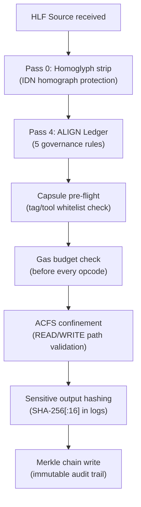

### Operator Trust Chain

```mermaid
flowchart LR
    Intent[Intent input<br/>plain language or HLF] --> Policy[Policy and governance<br/>ALIGN and ethical governor]
    Policy --> Capsule[Capsule and admission<br/>tier, tool, gas, verifier gates]
    Capsule --> Exec[Execution and runtime<br/>bytecode, tools, host effects]
    Exec --> Evidence[Evidence surfaces<br/>memory, witness, traces, Merkle chain]
    Evidence --> Operator[Operator-readable output<br/>audit summary, rationale, export]

    classDef intent fill:#dce9f9,stroke:#285a8f,color:#12263f
    classDef policy fill:#f7e5d8,stroke:#9a5b2e,color:#3d200d
    classDef exec fill:#e8f2e1,stroke:#4c7a4c,color:#173117
    classDef evidence fill:#efe3f8,stroke:#6f3f8f,color:#2a1736
    classDef operator fill:#f4f1ea,stroke:#705f49,color:#2b241a

    class Intent intent
    class Policy,Capsule policy
    class Exec exec
    class Evidence evidence
    class Operator operator
```

Reading rule:

- the trust chain is what the repo is trying to keep continuous from intent to operator review
- if any middle step becomes opaque, the public claims get weaker even if the runtime still executes
- this is why governance, admission, evidence, and human-readable output are treated as core surfaces rather than extras

| Layer | What it prevents |
| --- | --- |
| Homoglyph normalization | IDN homograph attacks via Cyrillic/Greek lookalikes |
| ALIGN Ledger | Credential leaks, SSRF, shell injection, path traversal, exfil |
| Intent Capsules | Tag/tool/function access violations per tier |
| Gas metering | Infinite loops, runaway compute |
| ACFS confinement | Directory escape / path traversal at file I/O layer |
| Sensitive output hashing | Credential values never appear in logs |
| Merkle chain | Tamper-evident audit trail on every memory write |
| ULID nonce | 600s TTL replay deduplication (planned integration) |

### Ethical Governor — Fully Implemented

The governor is wired into the compiler pipeline as a mandatory pre-flight gate. It runs before bytecode generation and raises `CompileError` on any high-severity signal — no partial execution, no silent bypass.

| Module | Responsibility |
| --- | --- |
| `constitution.py` | Hard-law violations: lethal content, CSAM, absolute blocks; tier escalation checks |
| `termination.py` | Fail-closed termination, ULID audit log, appealable vs. non-appealable articles |
| `red_hat.py` | Declared red-hat research scope validation; fingerprint registry |
| `rogue_detection.py` | Prompt injection, jailbreak, aggressive verb, tier-smuggling detection |
| `governor.py` | Orchestrates all four modules; exposes `check()` and `raise_if_blocked()` |

**Compiler hook**: `compiler.py` calls `governor.raise_if_blocked()` at the end of Pass 4. Blocked programs raise `CompileError` with `RuleId`, `Article`, and full audit trail.

**Test coverage**: 44 dedicated tests in `tests/test_ethics.py` covering constitutional violations, termination audit log, red-hat declarations, rogue signal detection, and compiler integration.

### Cryptographic Stack

- **AES-256-GCM** — symmetric encryption with authentication tag (via Python `cryptography` library)
- **PBKDF2-HMAC-SHA256** — key derivation, 600,000 iterations (OWASP 2024)
- **HMAC-SHA256** — message authentication / signing
- **SHA-256 Merkle tree** — lossless AST provenance chain
- **SHA-256 `.hlb` header** — bytecode integrity manifest

---

## 17. Development

### Install & Test

```bash
# Install all dependencies
uv sync

# Run the canonical automated suite
python run_tests.py
python -m hlf_mcp.test_runner

# Or call pytest directly
uv run pytest tests/ -q --tb=short

# Record a local weekly evidence snapshot
python scripts/run_pipeline_scheduled.py

# Run specific test modules
uv run pytest tests/test_compiler.py -v
uv run pytest tests/test_ethics.py -v
uv run pytest tests/test_formatter.py -v
uv run pytest tests/test_linter.py -v
uv run pytest tests/test_github_scripts.py -v
```

### CLI Tools

| Command | Description |
| --- | --- |
| `uv run hlfc <file.hlf>` | Compile HLF → JSON AST + bytecode |
| `uv run hlffmt <file.hlf>` | Canonicalize formatting |
| `uv run hlflint <file.hlf>` | Static linting |
| `uv run hlfrun <file.hlf>` | Execute in VM |
| `uv run hlfpm <command>` | Manage packaged HLF modules |
| `uv run hlflsp` | Start the packaged HLF language server |
| `uv run hlfsh` | Start interactive HLF shell |
| `uv run hlftest <path>` | Compile and lint HLF fixtures/snippets |
| `uv run python scripts/generate_tm_grammar.py` | Generate `syntaxes/hlf.tmLanguage.json` from packaged grammar metadata |
| `uv run python scripts/gen_docs.py` | Generate packaged tag, stdlib, and host-function reference docs |
| `uv run python scripts/verify_chain.py <trace.jsonl>` | Verify JSONL trace-chain integrity against computed hashes |
| `uv run python scripts/hlf_token_lint.py fixtures` | Enforce file and per-line token budgets on HLF sources |
| `uv run hlf-mcp` | Start MCP server |

### Project Structure

```text
hlf_mcp/
├── server.py               # FastMCP server and packaged MCP front door
├── hlf/
│   ├── grammar.py          # LALR(1) Lark grammar + glyph map + confusables
│   ├── compiler.py         # 5-pass compiler pipeline
│   ├── formatter.py        # Canonical formatter
│   ├── linter.py           # Static analysis
│   ├── bytecode.py         # Bytecode compiler + VM + disassembler
│   ├── runtime.py          # AST-level interpreter + 50+ builtins
│   ├── capsules.py         # Intent Capsule (hearth/forge/sovereign)
│   ├── registry.py         # HostFunctionRegistry (JSON-backed)
│   ├── tool_dispatch.py    # ToolRegistry + HITL gate
│   ├── oci_client.py       # OCI package registry client
│   ├── hlfpm.py            # Package manager (install/freeze/list)
│   ├── hlflsp.py           # Language server (diagnostics, completion, hover, definitions)
│   ├── translator.py       # HLF ↔ English translation (tone-aware)
│   ├── insaits.py          # InsAIts decompiler (AST/bytecode → English)
│   ├── memory_node.py      # MemoryNode + MemoryStore
│   ├── benchmark.py        # tiktoken compression analysis
│   └── stdlib/
│       ├── agent.py        crypto_mod.py   io_mod.py
│       ├── math_mod.py     net_mod.py      string_mod.py
│       ├── system_mod.py   collections_mod.py
├── rag/
│   └── memory.py           # Infinite RAG SQLite memory store
└── instinct/
    └── lifecycle.py        # Instinct SDD state machine + CoVE gate

governance/
├── bytecode_spec.yaml      # ← Single source of truth for all opcodes
├── host_functions.json     # 32 host functions (tier/gas/backend/sensitive)
├── align_rules.json        # 5 ALIGN Ledger governance rules
├── module_import_rules.yaml# Import policy extracted from Sovereign source
└── templates/
    └── dictionary.json     # Tag/glyph dictionary for future tooling

fixtures/                   # 11 example HLF programs
scripts/
├── generate_tm_grammar.py  # Build TextMate grammar from packaged HLF metadata
├── gen_docs.py             # Build packaged tag and stdlib reference docs
├── hlf_token_lint.py       # Token-budget linting for .hlf corpora
├── live_api_test.py
└── monitor_model_drift.py
syntaxes/
└── hlf.tmLanguage.json     # Generated HLF syntax grammar
docs/
├── HLF_GRAMMAR_REFERENCE.md # Adapted packaged grammar reference
├── HLF_TAG_REFERENCE.md    # Generated from governance/templates/dictionary.json
├── HLF_STDLIB_REFERENCE.md # Generated from packaged Python stdlib bindings
├── stdlib.md               # Adapted packaged stdlib guide
└── ...
tests/                      # pytest test suite
Dockerfile                  # Multi-stage production build
docker-compose.yml          # Service composition with health check
```

### Linting

```bash
uv run ruff check hlf_mcp/
uv run ruff format hlf_mcp/
```

---

## 18. Roadmap

### Phase 1 — Foundation ✅ (this PR)

- [x] LALR(1) grammar: 21 statement types, 7 glyphs, expression precedence
- [x] 5-pass compiler pipeline with ALIGN Ledger validation
- [x] Bytecode VM: 37 opcodes, gas metering, SHA-256 `.hlb` header
- [x] Fixed opcode conflict (`OPENCLAW_TOOL` `0x65` → `0x53`)
- [x] `governance/bytecode_spec.yaml` as single source of truth
- [x] 32 host functions with tier/gas/backend enforcement
- [x] Intent Capsules: hearth / forge / sovereign tiers
- [x] 8 stdlib modules (no stubs — AES-256-GCM crypto, PBKDF2, HMAC-SHA256)
- [x] Infinite RAG subsystem (SQLite WAL, Merkle lineage, cosine dedup)
- [x] HKS bridge surfaces (validated exemplar capture/recall, weekly artifact hooks, governed knowledge contracts)
- [x] Instinct SDD lifecycle (SPECIFY→PLAN→EXECUTE→VERIFY→MERGE, CoVE gate)
- [x] FastMCP server with packaged tools, packaged resources, and stdio + SSE + streamable-HTTP transports
- [x] Multi-stage Docker image + docker-compose with health check
- [x] Ethical Governor: 5-module compile-time gate (constitution · termination · red_hat · rogue_detection · governor)
- [x] Packaged default pytest suite is green in this branch; use `python run_tests.py` or `hlf_test_suite_summary` for current counts

### Phase 2 — Harden Semantics 🔨 (in progress)

- [x] **Ollama Cloud client**: streaming, thinking, structured outputs, tool calling, web search, 4-tier fallback chain with circuit breaker (`.github/scripts/ollama_client.py`)
- [x] **Weekly automation baseline**: 7 scheduled GitHub workflows — code quality, spec sentinel, model drift detection, ethics review, doc/security review, test health, and evolution planner — now being normalized onto a shared weekly artifact schema
- [x] **Model drift monitoring**: 7 weighted semantic probes with structured output scoring (`scripts/monitor_model_drift.py`)
- [ ] **Vector embeddings**: `sqlite-vec` C extension for real cosine search (replacing bag-of-words)
- [ ] **SHA-256 dedup cache**: pre-embedding content deduplication layer
- [ ] **Fractal summarisation**: map-reduce context compression when memory approaches token limit
- [ ] **Hot/Warm/Cold tiering**: Redis hot → SQLite warm → Parquet cold context transfer
- [x] **LSP server** (`hlflsp`): packaged diagnostics, completion, hover, document symbols, go-to-definition
- [x] **hlfsh REPL**: interactive shell on the packaged compiler/linter surface
- [x] **hlftest runner**: packaged compile + lint harness for snippets, files, and fixture directories

Branch-aware note for current checkout:

- [x] **Governed review contracts**: normalized review payloads now exist for spec drift, test health, ethics review, code quality, doc accuracy, and security-pattern review (`hlf_mcp/governed_review.py`)
- [x] **Operator evidence surfaces**: weekly artifact decision persistence and evidence query/reporting are already packaged on this branch (`hlf_mcp/weekly_artifacts.py`, `tests/test_evidence_query.py`)
- [x] **Symbolic relation-edge proof slice**: ASCII-first symbolic extraction, projection, and audit logging are present and tested (`hlf_mcp/hlf/symbolic_surfaces.py`, `tests/test_symbolic_surfaces.py`)
- [x] **Dream-cycle and media-evidence bridge slice**: advisory dream findings, media evidence normalization, citation-chain proposals, and multimodal contract resources are present in this branch and remain bridge-lane surfaces rather than full target-state completion (`hlf_mcp/server_context.py`, `hlf_mcp/server_memory.py`, `hlf_mcp/server_resources.py`, `tests/test_dream_cycle.py`)
- [x] **VS Code operator bridge scaffold**: a claim-lane-aware operator shell scaffold exists under `extensions/hlf-vscode/`; treat it as bridge work, not Marketplace-shipped completion

Reviewer note:

- use `docs/HLF_BRANCH_AWARE_CLAIMS_LEDGER_2026-03-20.md` for a compact public-facing classification of overstated public gaps, valid public gaps, branch-resolved gaps, and still-open architectural gaps
- use `docs/HLF_MERGE_READINESS_SUMMARY_2026-03-20.md` for the current branch split between `current-true`, `bridge-true`, and still-open architectural work

- use `docs/HLF_REVIEWER_HANDOFF_2026-03-20.md` for a PR-ready reviewer handoff distilled from the merge-readiness summary

### Phase 3 — Universal Usability 🌐 (planned)

- [ ] **ASCII surface**: round-trip `IF risk > 0 THEN [RESULT]` ↔ `⊎ risk > 0 ⇒ [RESULT]`
- [ ] **WASM target**: compile HLF programs to WebAssembly for browser/edge execution
- [ ] **OCI registry push**: complete `OCIClient.push()` for module publishing
- [ ] **Z3 formal verification**: `z3_verify` host function — prove SPEC_GATE assertions hold
- [ ] **EGL Monitor**: MAP-Elites quality-diversity grid tracking agent specialization drift
- [ ] **Tool HITL gate UI**: web dashboard for approving `pending_hitl` tools
- [ ] **SpindleDAG executor**: task DAG with Saga compensating transactions

### Phase 4 — Ecosystem Integration 🔗 (planned)

Integrations with the Sovereign Agentic OS via HLF host functions:

| Integration | HLF Host Functions | Status |
| --- | --- | --- |
| Project Janus (RAG pipeline) | `janus.crawl`, `janus.query`, `janus.archive` | 📋 Planned |
| OVERWATCH (sentinel watchdog) | `overwatch.scan`, `overwatch.terminate` | 📋 Planned |
| API-Keeper (credential vault) | `apikeeper.store`, `apikeeper.rotate` | 📋 Planned |
| SearXng MCP (private search) | `searxng.search`, `searxng.crawl` | 📋 Planned |
| AnythingLLM | `anythingllm.workspace_query`, `anythingllm.agent_flow` | 📋 Planned |
| LOLLMS | `lollms.generate`, `lollms.rag_query` | 📋 Planned |
| ollama_pulse (model catalog) | `pulse.scan`, `pulse.update_catalog` | 📋 Planned |
| Jules_Choice (coding agent) | `jules.spawn_session`, `jules.execute_sdd` | 📋 Planned |

### Phase 5 — Standard, Not a Project 🏛️ (long-term)

- [ ] **Conformance suite**: canonical test vectors for every opcode and grammar production
- [ ] **Generated docs**: all normative docs generated from `governance/` spec files — no hand-edited drift
- [ ] **HLF profiles**: publish HLF-Core / HLF-Effects / HLF-Agent / HLF-Memory / HLF-VM as separable specs
- [ ] **Cross-model alignment test**: verify any LLM can produce valid HLF without fine-tuning
- [ ] **Dream State self-improvement**: nightly DSPy regression on compressed HLF rules
- [ ] **HLF self-programming**: the OS eventually writes its own HLF programs to orchestrate integrations

---

## Related Links

- 📖 [Packaged HLF Reference](docs/HLF_REFERENCE.md)
- 🧾 [CLI Tools Reference](docs/cli-tools.md)
- 📚 [Host Functions Reference](docs/HLF_HOST_FUNCTIONS_REFERENCE.md)
- 🔄 [Packaged Instinct Reference](docs/INSTINCT_REFERENCE.md)
- 📜 [RFC 9000 Series](https://github.com/Grumpified-OGGVCT/Sovereign_Agentic_OS_with_HLF/blob/main/docs/RFC_9000_SERIES.md)
- 🗺️ [Unified Ecosystem Roadmap](https://github.com/Grumpified-OGGVCT/Sovereign_Agentic_OS_with_HLF/blob/main/docs/UNIFIED_ECOSYSTEM_ROADMAP.md)
- 🏗️ [Walkthrough](https://github.com/Grumpified-OGGVCT/Sovereign_Agentic_OS_with_HLF/blob/main/docs/WALKTHROUGH.md)
- 🔬 [NotebookLM Research Notebook](https://notebooklm.google.com) — 291 sources, deep research reports, RFC catalog

---

*HLF is not primarily a syntax. It is a **contract for deterministic meaning under bounded capability**. Syntax is reversible, semantics are canonical, effects are explicit, execution is reproducible, audit is built-in, tooling is generated, evolution is governed.*
