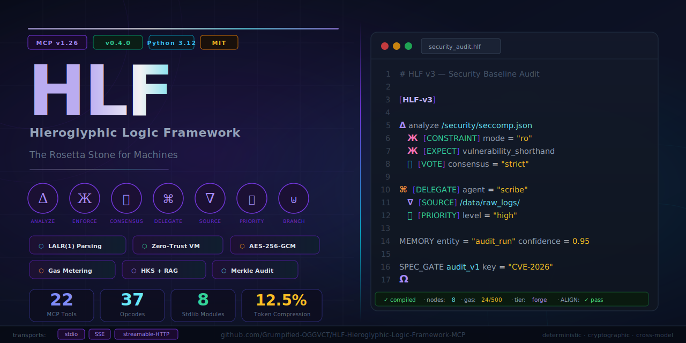
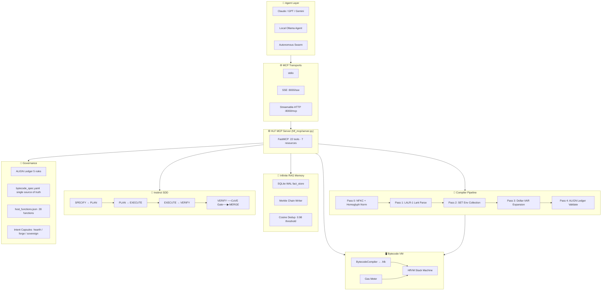
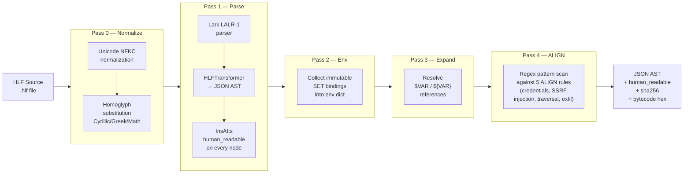
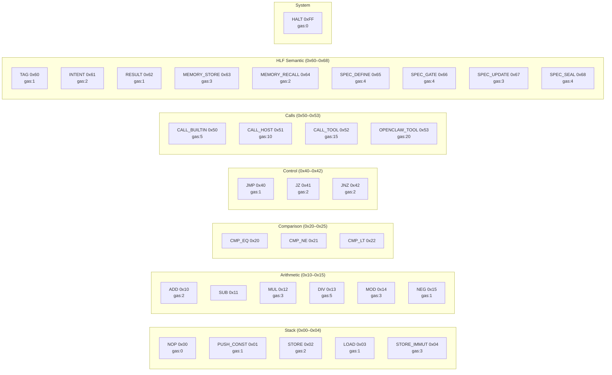
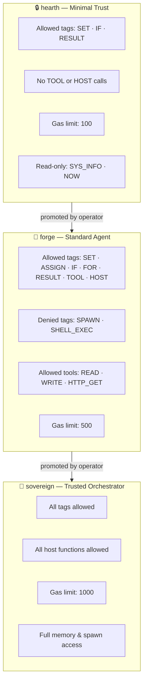
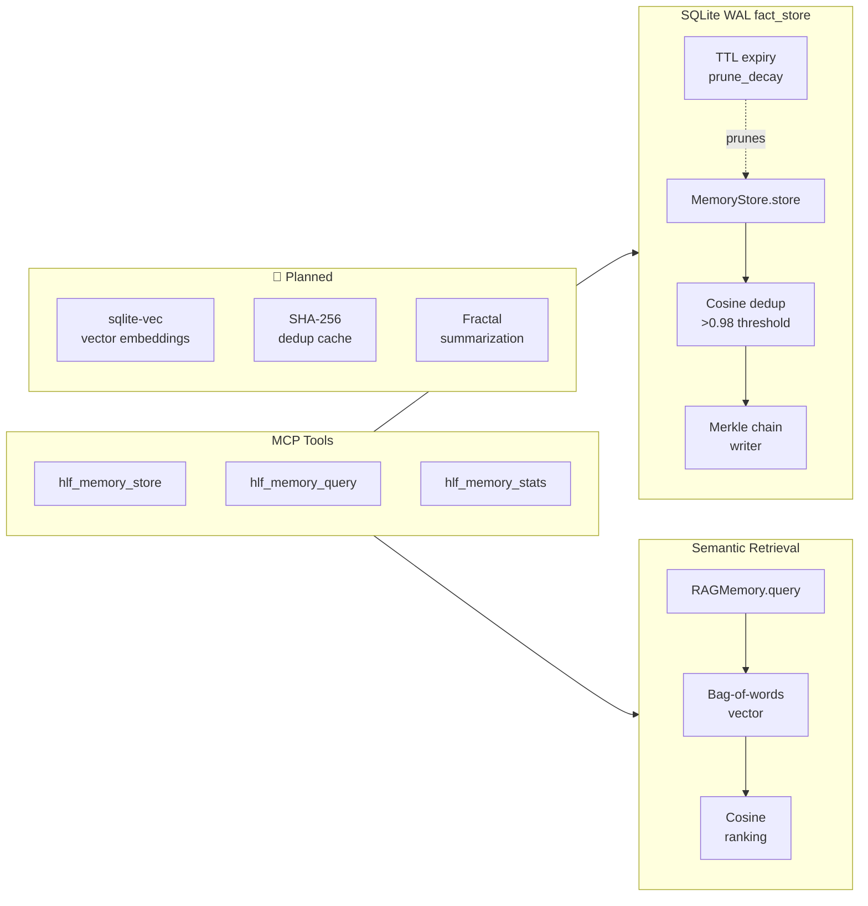
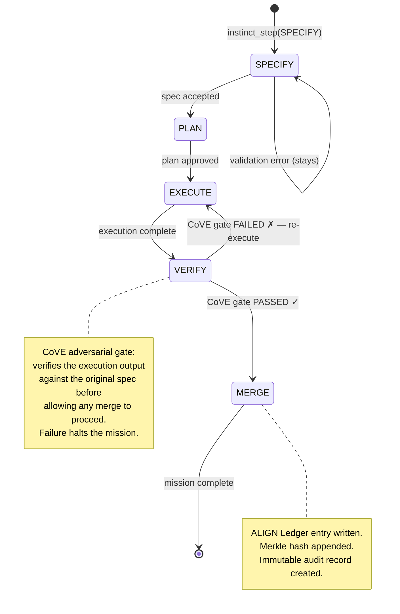
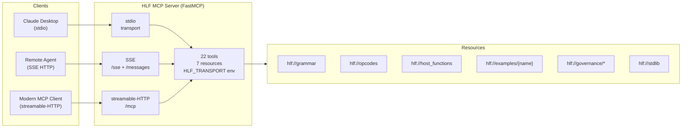
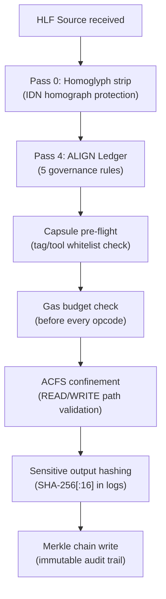

# 📜 HLF — Hieroglyphic Logic Framework · MCP Server

> **The Rosetta Stone for Machines.** A deterministic orchestration protocol that replaces natural language ambiguity with a strictly-typed Hieroglyphic AST — enabling zero-trust agent execution, cryptographic governance, and ultra-dense token efficiency across every model and runtime.

[](https://python.org)
[](governance/bytecode_spec.yaml)
[](https://modelcontextprotocol.io)
[](LICENSE)

<p align="center">
  
</p>

> 💡 **Repo social preview**: Go to **Settings → Social preview** and upload a PNG export of [`docs/social_preview.svg`](docs/social_preview.svg) (1280×640px) so this card appears when the link is shared in Discord, forums, and social media.

---

## Table of Contents

1. [What is HLF?](#1-what-is-hlf)
   - [Ethos — People First, Transparent Governance](#ethos--people-first-transparent-governance)
2. [Quick Start](#2-quick-start)
3. [Architecture Overview](#3-architecture-overview)
4. [Grammar & Language Reference](#4-grammar--language-reference)
5. [Compiler Pipeline (5 Passes)](#5-compiler-pipeline-5-passes)
6. [Bytecode VM](#6-bytecode-vm)
7. [Intent Capsule Tier Model](#7-intent-capsule-tier-model)
8. [Host Function Registry](#8-host-function-registry)
9. [Stdlib — 8 Complete Modules](#9-stdlib--8-complete-modules)
10. [Infinite RAG Memory](#10-infinite-rag-memory)
11. [Instinct SDD Lifecycle](#11-instinct-sdd-lifecycle)
12. [MCP Server & Transports](#12-mcp-server--transports)
13. [MCP Tools Reference](#13-mcp-tools-reference)
14. [Docker Deployment](#14-docker-deployment)
15. [Benchmark Results](#15-benchmark-results)
16. [Governance & Security](#16-governance--security)
17. [Development](#17-development)
18. [Roadmap](#18-roadmap)

---

## 1. What is HLF?

HLF is **not** another DSL. It is a **deterministic orchestration protocol** designed as a formal coordination layer between AI agents, replacing natural-language prose with a strictly-typed Hieroglyphic Abstract Syntax Tree.

```
[HLF-v3]
Δ analyze /security/seccomp.json
  Ж [CONSTRAINT] mode="ro"
  Ж [EXPECT] vulnerability_shorthand
  ⨝ [VOTE] consensus="strict"
Ω
```

### Core Properties

| Property | Mechanism |
|---|---|
| **Deterministic Intent** | LALR(1) parsing — 100% reproducible execution paths, zero ambiguity |
| **Token Compression** | 12–30% vs NLP prose; up to 83% vs verbose JSON (tiktoken cl100k_base) |
| **Cryptographic Governance** | SHA-256 / Merkle-chain audit trail on every intent and memory write |
| **Gas Metering** | Hard execution budget — every opcode deducts gas, preventing runaway loops |
| **Cross-Model Alignment** | Any LLM (local or cloud) can read and emit valid HLF without special training |
| **Zero-Trust Execution** | Intent Capsules bound what each agent tier can read, write, and call |

### The 5-Surface Language

HLF programs exist in five interchangeable, round-trippable representations:

```
Glyph Source  ──compile──▶  JSON AST  ──codegen──▶  .hlb Bytecode
     ▲                          │                         │
     │ hlffmt                   │ insaits                 │ disassemble
     │                          ▼                         ▼
ASCII Source            English Audit             Assembly Listing
```

### Ethos — People First, Transparent Governance

- People and their work are the priority; privacy is default, and HLF enforces hard laws rather than paternalistic filters.
- AI is the tool — humans author the constraints, which stay transparent and auditable in-repo.
- Ethical Governor (in progress) will fail closed before harm, support declared red-hat research paths, and document every decision.
- Transparency over surveillance: governance files (ALIGN rules, ethics docs) stay human-readable so constraints can be inspected and debated.
- Use HLF freely; when boundaries apply, they are explicit, scoped to protect people, and never to suppress legitimate research or creativity.

See `docs/ETHICAL_GOVERNOR_HANDOFF.md` for the handoff brief guiding the downstream ethics module implementation.

---

## 2. Quick Start

### Option A — Docker (recommended for any agent)

```bash
# SSE transport (remote agents, web clients)
docker run -e HLF_TRANSPORT=sse -p 8000:8000 ghcr.io/grumpified-oggvct/hlf-mcp:latest

# Streamable-HTTP transport (modern MCP clients)
docker run -e HLF_TRANSPORT=streamable-http -p 8000:8000 ghcr.io/grumpified-oggvct/hlf-mcp:latest

# stdio transport (Claude Desktop, local agents)
docker run -i -e HLF_TRANSPORT=stdio ghcr.io/grumpified-oggvct/hlf-mcp:latest
```

**Endpoints when SSE is active:**

| Path | Purpose |
|---|---|
| `GET /sse` | SSE event stream (MCP handshake) |
| `POST /messages/` | MCP message endpoint |
| `GET /health` | Health check (returns `{"status":"ok"}`) |

### Option B — Local install

```bash
# 1. Install with uv (Python ≥ 3.12 required)
uv sync

# 2. Compile and run a fixture
uv run hlfc fixtures/security_audit.hlf
uv run hlfrun fixtures/hello_world.hlf

# 3. Start MCP server on SSE port 8000
HLF_TRANSPORT=sse uv run hlf-mcp
```

### Option C — Docker Compose (full stack)

```bash
docker compose up -d
# MCP SSE server → http://localhost:8000/sse
# Health check  → http://localhost:8000/health
```

### Claude Desktop (`claude_desktop_config.json`)

```json
{
  "mcpServers": {
    "hlf": {
      "command": "docker",
      "args": ["run", "-i", "--rm", "-e", "HLF_TRANSPORT=stdio",
               "ghcr.io/grumpified-oggvct/hlf-mcp:latest"]
    }
  }
}
```

---

## 3. Architecture Overview



---

## 4. Grammar & Language Reference

### The 7 Hieroglyphic Glyphs

Every HLF statement begins with one of seven Unicode glyphs. Each glyph carries semantic meaning and maps to a specific bytecode opcode:

| Glyph | Name | Semantic Role | ASCII Alias | Opcode |
|---|---|---|---|---|
| `Δ` | DELTA | Analyze / primary action | `ANALYZE` | `0x51` |
| `Ж` | ZHE | Enforce / constrain / assert | `ENFORCE` | `0x60` |
| `⨝` | JOIN | Consensus / join / vote | `JOIN` | `0x61` |
| `⌘` | COMMAND | Command / delegate / route | `CMD` | `0x52` |
| `∇` | NABLA | Source / parameter / data flow | `SOURCE` | `0x01` |
| `⩕` | BOWTIE | Priority / weight / rank | `PRIORITY` | `0x11` |
| `⊎` | UNION | Branch / condition / union | `BRANCH` | `0x41` |

### Statement Types (21 total)

```
glyph_stmt   — Δ/Ж/⨝/⌘/∇/⩕/⊎ [TAG] key="val" ...
set_stmt     — SET name = expr          (immutable binding)
assign_stmt  — ASSIGN name = expr       (mutable binding)
if_block     — IF expr { ... } ELIF expr { ... } ELSE { ... }
if_flat      — IF expr => stmt
for_stmt     — FOR name IN expr { ... }
parallel_stmt— PARALLEL { ... } { ... }
func_stmt    — FUNCTION name(args) { ... }
intent_stmt  — INTENT name key="val" { ... }
tool_stmt    — TOOL name key="val"
call_stmt    — CALL name(args)
result_stmt  — RESULT code msg?
log_stmt     — LOG "message"
import_stmt  — IMPORT module_name
memory_stmt  — MEMORY entity confidence="0.9" content="..."
recall_stmt  — RECALL entity top_k=5
spec_define  — SPEC_DEFINE name key="val"
spec_gate    — SPEC_GATE name key="val"
spec_update  — SPEC_UPDATE name key="val"
spec_seal    — SPEC_SEAL name
```

### Canonical Tags

```
INTENT  CONSTRAINT  ASSERT  EXPECT  DELEGATE  ROUTE  SOURCE
PARAM   PRIORITY    VOTE    RESULT  MEMORY    RECALL
GATE    DEFINE      MIGRATION  ALIGN
```

### Expression Precedence (low → high)

```
_expr   (20) : ==  !=  <  >  <=  >=  AND  OR
_term   (30) : +  -
_factor (40) : *  /  %
_unary  (50) : NOT  -  (unary negation)
_atom        : string · int · float · bool · $VAR · ${VAR} · ident · path
```

### Program Structure

```
[HLF-v3]          ← header: version declaration
<statements>       ← body: one or more statements
Ω                  ← omega terminator (required)
```

### Type Annotations (`TYPE_SYM`)

```
𝕊  — string    ℕ  — integer    𝔹  — boolean    𝕁  — JSON    𝔸  — any
```

### Example Programs

<details>
<summary><strong>Hello World</strong></summary>

```hlf
# HLF v3 — Hello World
[HLF-v3]
Δ [INTENT] goal="hello_world"
  Ж [ASSERT] status="ok"
  ∇ [RESULT] message="Hello, World!"
Ω
```
</details>

<details>
<summary><strong>Security Baseline Audit (Sentinel Mode)</strong></summary>

```hlf
# HLF v3 — Security Baseline Audit
[HLF-v3]
Δ analyze /security/seccomp.json
  Ж [CONSTRAINT] mode="ro"
  Ж [EXPECT] vulnerability_shorthand
  ⨝ [VOTE] consensus="strict"
Ω
```
</details>

<details>
<summary><strong>Multi-Agent Task Delegation (Orchestrator Mode)</strong></summary>

```hlf
# HLF v3 — Multi-Agent Task Delegation
[HLF-v3]
⌘ [DELEGATE] agent="scribe" goal="fractal_summarize"
  ∇ [SOURCE] /data/raw_logs/matrix_sync_2026.txt
  ⩕ [PRIORITY] level="high"
  Ж [ASSERT] vram_limit="8GB"
Ω
```
</details>

<details>
<summary><strong>Real-Time Resource Mediation (MoMA Router)</strong></summary>

```hlf
# HLF v3 — MoMA Router
[HLF-v3]
⌘ [ROUTE] strategy="auto" tier="${DEPLOYMENT_TIER}"
  ∇ [PARAM] temperature=0.0
  Ж [VOTE] confirmation="required"
Ω
```
</details>

---

## 5. Compiler Pipeline (5 Passes)



### Homoglyph Confusables (Pass 0)

Pass 0 prevents **IDN homograph attacks** — where a visually identical Cyrillic `а` replaces Latin `a` to smuggle unexpected behaviour through the parser:

| Category | Example substitutions |
|---|---|
| Cyrillic | `а→a` `е→e` `о→o` `р→p` `с→c` `х→x` `у→y` |
| Greek | `α→a` `ε→e` `ο→o` `ρ→p` `σ→s` |
| Math operators | `−→-` `×→*` `÷→/` `≠→!=` `≤→<=` `≥→>=` |

---

## 6. Bytecode VM

### Binary Format (`.hlb`)

```
Offset  Size   Field
──────  ─────  ────────────────────────────────────────────
0       32     SHA-256 manifest hash (integrity guard)
32      4      Magic bytes: "HLB\x00"
36      2      Format version (0x0004 = v0.4)
38      4      Code section length (little-endian uint32)
42      4      CRC32 checksum of code section
46      2      Flags (reserved, must be 0)
48      ...    Constant pool (typed entries)
48+n    ...    Code section (3-byte fixed instructions)
```

### Instruction Format

Every instruction is exactly **3 bytes**:

```
[opcode: 1 byte] [operand: 2 bytes little-endian]
```

### Opcode Table (37 opcodes)



> **Opcode conflict fixed**: `OPENCLAW_TOOL` was previously at `0x65`, conflicting with the Instinct spec opcodes. It is now at `0x53`. The `governance/bytecode_spec.yaml` file is the **single source of truth** — all enum values in code are generated from it.

### Constant Pool Encoding

```
Type   Byte   Encoding
─────  ─────  ──────────────────────────────
INT    0x01   <Bq>  little-endian signed 64-bit
FLOAT  0x02   <Bd>  IEEE-754 double
STRING 0x03   <BI><UTF-8 bytes>  length-prefixed
BOOL   0x04   <BB>  0x00=false / 0x01=true
NULL   0x05   <B>   no payload
```

### Gas Model

| Tier | Gas Limit | Use Case |
|---|---|---|
| `hearth` | 100 | Untrusted / minimal agents |
| `forge` | 500 | Standard agents |
| `sovereign` | 1000 | Trusted orchestrators |
| `CALL_HOST` | from registry | Actual gas from `host_functions.json` |
| `CALL_TOOL` | 15 (base) | Registered tool calls |
| `OPENCLAW_TOOL` | 20 | Sandboxed external tools |

The VM meters gas **before** each dispatch. On budget breach it raises `HlfVMGasExhausted` immediately — no partial execution.

---

## 7. Intent Capsule Tier Model

Intent Capsules bound what each agent tier can read, write, and call — enforced at both static (pre-flight AST check) and dynamic (runtime) levels.



### Capsule Pre-Flight Validation

Before any VM execution, the capsule checks the AST statically:

1. **Tag whitelist/blacklist** — denied tags raise `CapsuleViolation` before the first instruction runs
2. **Tool/function whitelist** — `TOOL` and `HOST` nodes checked against `allowed_tools` / `denied_tools`
3. **Read-only variable guard** — `SET` and `ASSIGN` to protected vars (`SYS_INFO`, `NOW`) blocked
4. **Gas budget** — cumulative gas from host calls tracked against `max_gas`

---

## 8. Host Function Registry

28 host functions are defined in `governance/host_functions.json`. Each has `tier`, `gas`, `backend`, and `sensitive` fields enforced at runtime:

| Function | Tiers | Gas | Backend | Sensitive |
|---|---|---|---|---|
| `READ` | all | 1 | `dapr_file_read` | ✗ |
| `WRITE` | all | 2 | `dapr_file_write` | ✗ |
| `SPAWN` | forge, sovereign | 5 | `docker_orchestrator` | ✗ |
| `SLEEP` | all | 0 | `builtin` | ✗ |
| `HTTP_GET` | forge, sovereign | 3 | `dapr_http_proxy` | ✗ |
| `HTTP_POST` | forge, sovereign | 4 | `dapr_http_proxy` | ✗ |
| `WEB_SEARCH` | forge, sovereign | 5 | `dapr_http_proxy` | ✓ |
| `analyze` | all | 3 | `native_bridge` | ✗ |
| `hash_sha256` | all | 1 | `builtin` | ✗ |
| `merkle_chain` | all | 2 | `builtin` | ✗ |
| `log_emit` | all | 1 | `builtin` | ✗ |
| `assert_check` | all | 1 | `builtin` | ✗ |
| `memory_store` | all | 3 | `rag_memory` | ✗ |
| `memory_recall` | all | 2 | `rag_memory` | ✗ |
| `vote` | forge, sovereign | 2 | `native_bridge` | ✗ |
| `delegate` | forge, sovereign | 4 | `native_bridge` | ✗ |
| `route` | forge, sovereign | 3 | `native_bridge` | ✗ |
| `get_timestamp` | all | 0 | `builtin` | ✗ |
| `generate_ulid` | all | 0 | `builtin` | ✗ |
| `compress_tokens` | all | 2 | `builtin` | ✗ |
| `summarize` | forge, sovereign | 10 | `zai_client` | ✗ |
| `embed_text` | forge, sovereign | 5 | `zai_client` | ✗ |
| `cosine_similarity` | all | 2 | `builtin` | ✗ |
| `cove_validate` | all | 5 | `native_bridge` | ✗ |
| `align_verify` | all | 2 | `builtin` | ✗ |
| `z3_verify` | sovereign | 20 | `z3_native` | ✗ |
| `get_vram` | forge, sovereign | 1 | `native_bridge` | ✗ |
| `get_tier` | all | 0 | `builtin` | ✗ |

> **Sensitive outputs**: Functions with `sensitive=true` never log raw return values — only a `SHA-256[:16]` prefix is written to audit logs.

---

## 9. Stdlib — 8 Complete Modules

All stdlib modules are fully implemented (no stubs). They are importable in HLF via `IMPORT module_name` and callable as `module_name.FUNCTION(args)`.

| Module | Key Functions |
|---|---|
| `agent` | `AGENT_ID`, `AGENT_TIER`, `AGENT_CAPABILITIES`, `SET_GOAL`, `GET_GOALS`, `COMPLETE_GOAL` |
| `collections` | `LIST_LENGTH/APPEND/CONCAT/FILTER/MAP/REDUCE`, `DICT_GET/SET/KEYS/VALUES` |
| `crypto` | `ENCRYPT` (AES-256-GCM), `DECRYPT`, `KEY_GENERATE`, `KEY_DERIVE` (PBKDF2-HMAC-SHA256 600K iter), `SIGN/SIGN_VERIFY` (HMAC-SHA256), `HASH/HASH_VERIFY`, `MERKLE_ROOT`, `MERKLE_CHAIN_APPEND` |
| `io` | `FILE_READ/WRITE/EXISTS/DELETE`, `DIR_LIST/CREATE`, `PATH_JOIN/BASENAME/DIRNAME` (all ACFS-confined) |
| `math` | `MATH_ABS/FLOOR/CEIL/ROUND/MIN/MAX/POW/SQRT/LOG/SIN/COS/TAN/PI/E` |
| `net` | `HTTP_GET/POST/PUT/DELETE`, `URL_ENCODE/DECODE` |
| `string` | `STRING_LENGTH/CONCAT/SPLIT/JOIN/UPPER/LOWER/TRIM/REPLACE/CONTAINS/STARTS_WITH/ENDS_WITH/SUBSTRING` |
| `system` | `SYS_OS/ARCH/CWD/ENV/SETENV/TIME/SLEEP/EXIT/EXEC` |

### Crypto Module — AES-256-GCM (No Stubs)

```python
# ENCRYPT: random 12-byte nonce, AES-256-GCM, returns base64(nonce + GCM-tag + ciphertext)
result = crypto.ENCRYPT(plaintext, key_b64)

# DECRYPT: authenticates GCM tag before releasing plaintext — fails on tamper
plain  = crypto.DECRYPT(ciphertext_b64, key_b64)

# KEY_DERIVE: PBKDF2-HMAC-SHA256, 600,000 iterations (OWASP 2024 recommendation)
key    = crypto.KEY_DERIVE(password, salt_b64)

# MERKLE_ROOT: SHA-256 binary tree — lossless round-trip from AST
root   = crypto.MERKLE_ROOT(["leaf1", "leaf2", "leaf3"])
```

---

## 10. Infinite RAG Memory

The Infinite RAG eliminates the context-window ceiling by persisting, deduplicating, and tiering agent knowledge across sessions.



### Memory Properties

| Property | Implementation |
|---|---|
| **Persistence** | SQLite WAL mode — survives restarts |
| **Cosine dedup** | Bag-of-words cosine similarity; nodes with similarity `>0.98` rejected as duplicates |
| **Merkle chain** | Every write appends a SHA-256 chain link for forensic audit |
| **TTL expiry** | `prune_decay()` removes entries past their TTL |
| **Entity indexing** | Per-entity namespace; `query(entity, text, top_k)` returns ranked results |
| **Tag indexing** | Entries tagged for cross-entity retrieval |

### HLF ↔ Infinite RAG Synergy

| Without HLF | With HLF |
|---|---|
| RAG ingests verbose NLP → bloated store | RAG ingests compressed HLF ASTs → smaller, denser entries |
| Context window fills quickly | HLF intents are 12–30% smaller → more facts per prompt |
| Cross-agent sharing is prose-ambiguous | Agents share typed, deterministic HLF → exact semantic match |
| Dream State compresses NLP → lossy | Dream State compresses HLF AST → lossless (round-trips) |
| No governance on memory writes | Every write passes through ALIGN Ledger validation via HLF |

---

## 11. Instinct SDD Lifecycle

Every agent mission enforces the deterministic **Specify → Plan → Execute → Verify → Merge** lifecycle. Phase skips and backward transitions are blocked. The CoVE gate is mandatory on `VERIFY → MERGE`.



### Lifecycle Rules

- **No phase skips**: Cannot jump from `SPECIFY` to `EXECUTE` — every intermediate phase is required
- **No backward transitions**: A `MERGE`d mission cannot reopen to `EXECUTE`
- **CoVE gate on VERIFY→MERGE**: If `cove_result.get("passed") == False`, the transition is blocked and the mission re-enters `EXECUTE`
- **ALIGN Ledger logging**: Every phase transition emits a ledger entry with SHA-256 hash and ULID timestamp

---

## 12. MCP Server & Transports



### Transport Configuration

| `HLF_TRANSPORT` | Endpoint | Typical Use |
|---|---|---|
| `stdio` (default) | stdin/stdout | Claude Desktop, local agents |
| `sse` | `GET /sse` + `POST /messages/` | Remote agents, Docker, web clients |
| `streamable-http` | `POST /mcp` | Modern MCP 1.26+ clients |

```bash
# Environment variables
HLF_TRANSPORT=sse           # transport type
HLF_HOST=0.0.0.0            # bind address (SSE/HTTP only)
HLF_PORT=8000               # port (SSE/HTTP only)
```

---

## 13. MCP Tools Reference

### Compiler & Analysis Tools

| Tool | Description | Key Parameters |
|---|---|---|
| `hlf_compile` | Parse HLF source → JSON AST + bytecode hex | `source: str` |
| `hlf_format` | Canonicalize: uppercase tags, trailing `Ω` | `source: str` |
| `hlf_lint` | Static analysis: token budget, gas, vars, specs | `source, gas_limit, token_limit` |
| `hlf_validate` | Quick syntax check → `{valid: bool, errors: [...]}` | `source: str` |
| `hlf_run` | Execute in VM, return result + trace | `source, tier, max_gas` |
| `hlf_disassemble` | `.hlb` hex → human-readable assembly | `bytecode_hex: str` |

### Translation & Decompilation

| Tool | Description |
|---|---|
| `hlf_translate_to_hlf` | English prose → HLF source (tone-aware) |
| `hlf_translate_to_english` | HLF source → natural language summary |
| `hlf_decompile_ast` | HLF source → structured English docs (AST level) |
| `hlf_decompile_bytecode` | HLF source → bytecode prose + disassembly |
| `hlf_similarity_gate` | Compare two HLF programs for semantic similarity (`cosine ≥ 0.95`) |

### Capsule & Security

| Tool | Description |
|---|---|
| `hlf_capsule_validate` | Pre-flight AST check against `hearth`/`forge`/`sovereign` capsule |
| `hlf_capsule_run` | Capsule-sandboxed compile + run (violations caught before VM entry) |
| `hlf_host_functions` | List host functions available for a tier |
| `hlf_host_call` | Directly call a host function from the registry |
| `hlf_tool_list` | List tools from the ToolRegistry |

### Memory & Instinct

| Tool | Description |
|---|---|
| `hlf_memory_store` | Store a fact in the Infinite RAG memory (with cosine dedup) |
| `hlf_memory_query` | Semantic search over the Infinite RAG memory |
| `hlf_memory_stats` | Node count, size, Merkle chain length |
| `hlf_instinct_step` | Advance an Instinct SDD lifecycle mission |
| `hlf_instinct_get` | Get current state of an Instinct mission |
| `hlf_spec_lifecycle` | Full SPECIFY→PLAN→EXECUTE→VERIFY→MERGE orchestration |

### Benchmarking

| Tool | Description |
|---|---|
| `hlf_benchmark` | Token compression analysis: HLF vs NLP prose |
| `hlf_benchmark_suite` | Run all 7 fixture benchmarks, return full table |

### Resources (read-only)

| URI | Contents |
|---|---|
| `hlf://grammar` | Full LALR(1) Lark grammar text |
| `hlf://opcodes` | Bytecode opcode table (37 opcodes) |
| `hlf://host_functions` | Available host function registry |
| `hlf://examples/{name}` | Example: `hello_world`, `security_audit`, `delegation`, `routing`, `db_migration`, `log_analysis`, `stack_deployment` |
| `hlf://governance/host_functions` | Raw `governance/host_functions.json` |
| `hlf://governance/bytecode_spec` | Raw `governance/bytecode_spec.yaml` |
| `hlf://governance/align_rules` | Raw `governance/align_rules.json` |
| `hlf://stdlib` | Stdlib module index with function lists |

---

## 14. Docker Deployment

### Multi-Stage Build

```dockerfile
# Stage 1: builder — installs all deps with uv
FROM python:3.12-slim AS builder
WORKDIR /app
COPY --from=ghcr.io/astral-sh/uv:latest /uv /uvx /bin/
COPY pyproject.toml uv.lock ./
RUN uv sync --frozen --no-dev

# Stage 2: runtime — minimal image, no build tools
FROM python:3.12-slim
COPY --from=builder /app /app
WORKDIR /app
EXPOSE 8000
HEALTHCHECK --interval=30s CMD curl -f http://localhost:8000/health || exit 1
ENV HLF_TRANSPORT=sse HLF_HOST=0.0.0.0 HLF_PORT=8000
CMD ["/app/.venv/bin/python", "-m", "hlf_mcp.server"]
```

### docker-compose.yml

```yaml
services:
  hlf-mcp:
    build: .
    ports:
      - "8000:8000"
    environment:
      HLF_TRANSPORT: sse
      HLF_HOST: 0.0.0.0
      HLF_PORT: "8000"
    healthcheck:
      test: ["CMD", "curl", "-f", "http://localhost:8000/health"]
      interval: 30s
      timeout: 10s
      retries: 3
    restart: unless-stopped
```

### Environment Reference

| Variable | Default | Description |
|---|---|---|
| `HLF_TRANSPORT` | `stdio` | Transport type: `stdio` / `sse` / `streamable-http` |
| `HLF_HOST` | `0.0.0.0` | Bind address for HTTP transports |
| `HLF_PORT` | `8000` | Port for HTTP transports |

---

## 15. Benchmark Results

Real compression ratios measured with **tiktoken cl100k_base** (OpenAI's tokenizer):

| Domain | NLP Tokens | HLF Tokens | Compression | 5-Agent Swarm Saved |
|---|---|---|---|---|
| **Hello World** | 71 | 50 | **29.6%** | 105 tokens |
| **Security Audit** | 105 | 78 | **25.7%** | 135 tokens |
| **Content Delegation** | 115 | 101 | **12.2%** | 70 tokens |
| **Database Migration** | 139 | 122 | **12.2%** | 85 tokens |
| **Log Analysis** | 129 | 120 | **7.0%** | 45 tokens |
| **Stack Deployment** | 104 | 109 | -4.8% | *(overhead)* |
| **Overall** | **663** | **580** | **12.5%** | **415 tokens/cycle** |

```
Token Compression by Domain
─────────────────────────────────────────────────────────────────
Hello World     [██████████████████████████████ 29.6%]
Security Audit  [█████████████████████████ 25.7%]
Delegation      [████████████ 12.2%]
DB Migration    [████████████ 12.2%]
Log Analysis    [███████ 7.0%]
Stack Deployment[░ -4.8%  (HLF tags add overhead for tiny payloads)]
─────────────────────────────────────────────────────────────────
Overall: 12.5% · In a 5-agent swarm: 415 tokens saved per broadcast cycle
```

> **Note**: Compression increases dramatically with payload complexity. Simple structural tasks like `deploy_stack` show near-parity because HLF's typed tags add overhead that matches NLP verbosity for short payloads. At scale (complex intents + swarm broadcasting), HLF's advantage compounds — 83 tokens saved × 5 agents = **415 tokens per cycle**.

---

## 16. Governance & Security

### ALIGN Ledger (5 Rules)

The ALIGN Ledger runs as Pass 4 in the compiler. Every string literal in the AST is scanned:

| Rule | ID | Pattern | Action |
|---|---|---|---|
| No credential exposure | `ALIGN-001` | `password=`, `api_key=`, `bearer ` etc. | **BLOCK** |
| No localhost SSRF | `ALIGN-002` | `http://127.0.0.1`, `http://localhost` | **WARN** |
| No shell injection | `ALIGN-003` | `exec(`, `eval(`, `popen(` | **BLOCK** |
| No path traversal | `ALIGN-004` | `../` `..\\` | **BLOCK** |
| No exfil patterns | `ALIGN-005` | `exfil`, `exfiltrate`, `dump creds` | **BLOCK** |

### Security Layers



| Layer | What it prevents |
|---|---|
| Homoglyph normalization | IDN homograph attacks via Cyrillic/Greek lookalikes |
| ALIGN Ledger | Credential leaks, SSRF, shell injection, path traversal, exfil |
| Intent Capsules | Tag/tool/function access violations per tier |
| Gas metering | Infinite loops, runaway compute |
| ACFS confinement | Directory escape / path traversal at file I/O layer |
| Sensitive output hashing | Credential values never appear in logs |
| Merkle chain | Tamper-evident audit trail on every memory write |
| ULID nonce | 600s TTL replay deduplication (planned integration) |

### Ethical Governor (people-first, in progress)
- Mission: humans first, AI as tool; constraints stay transparent and auditable in-repo.
- Scope: constitutional hard-law checks, declared red-hat research path, rogue detection, fail-closed termination.
- Status: scaffolding shipped (`hlf_mcp/hlf/ethics/` stubs + compiler hook); downstream agent must wire full logic.
- Handoff: see `docs/ETHICAL_GOVERNOR_HANDOFF.md` for required implementation steps and guardrails.

### Cryptographic Stack

- **AES-256-GCM** — symmetric encryption with authentication tag (via Python `cryptography` library)
- **PBKDF2-HMAC-SHA256** — key derivation, 600,000 iterations (OWASP 2024)
- **HMAC-SHA256** — message authentication / signing
- **SHA-256 Merkle tree** — lossless AST provenance chain
- **SHA-256 `.hlb` header** — bytecode integrity manifest

---

## 17. Development

### Install & Test

```bash
# Install all dependencies
uv sync

# Run test suite (42 tests)
uv run pytest tests/ -v

# Run specific test modules
uv run pytest tests/test_compiler.py -v
uv run pytest tests/test_formatter.py -v
uv run pytest tests/test_linter.py -v
```

### CLI Tools

| Command | Description |
|---|---|
| `uv run hlfc <file.hlf>` | Compile HLF → JSON AST + bytecode |
| `uv run hlffmt <file.hlf>` | Canonicalize formatting |
| `uv run hlflint <file.hlf>` | Static linting |
| `uv run hlfrun <file.hlf>` | Execute in VM |
| `uv run hlf-mcp` | Start MCP server |

### Project Structure

```
hlf_mcp/
├── server.py               # FastMCP server (22 tools, 7 resources)
├── hlf/
│   ├── grammar.py          # LALR(1) Lark grammar + glyph map + confusables
│   ├── compiler.py         # 5-pass compiler pipeline
│   ├── formatter.py        # Canonical formatter
│   ├── linter.py           # Static analysis
│   ├── bytecode.py         # Bytecode compiler + VM + disassembler
│   ├── runtime.py          # AST-level interpreter + 50+ builtins
│   ├── capsules.py         # Intent Capsule (hearth/forge/sovereign)
│   ├── registry.py         # HostFunctionRegistry (JSON-backed)
│   ├── tool_dispatch.py    # ToolRegistry + HITL gate
│   ├── oci_client.py       # OCI package registry client
│   ├── hlfpm.py            # Package manager (install/freeze/list)
│   ├── translator.py       # HLF ↔ English translation (tone-aware)
│   ├── insaits.py          # InsAIts decompiler (AST/bytecode → English)
│   ├── memory_node.py      # MemoryNode + MemoryStore
│   ├── benchmark.py        # tiktoken compression analysis
│   └── stdlib/
│       ├── agent.py        crypto_mod.py   io_mod.py
│       ├── math_mod.py     net_mod.py      string_mod.py
│       ├── system_mod.py   collections_mod.py
├── rag/
│   └── memory.py           # Infinite RAG SQLite memory store
└── instinct/
    └── lifecycle.py        # Instinct SDD state machine + CoVE gate

governance/
├── bytecode_spec.yaml      # ← Single source of truth for all opcodes
├── host_functions.json     # 28 host functions (tier/gas/backend/sensitive)
└── align_rules.json        # 5 ALIGN Ledger governance rules

fixtures/                   # 7 example HLF programs
tests/                      # pytest test suite (42 tests)
Dockerfile                  # Multi-stage production build
docker-compose.yml          # Service composition with health check
```

### Linting

```bash
uv run ruff check hlf_mcp/
uv run ruff format hlf_mcp/
```

---

## 18. Roadmap

### Phase 1 — Foundation ✅ (this PR)

- [x] LALR(1) grammar: 21 statement types, 7 glyphs, expression precedence
- [x] 5-pass compiler pipeline with ALIGN Ledger validation
- [x] Bytecode VM: 37 opcodes, gas metering, SHA-256 `.hlb` header
- [x] Fixed opcode conflict (`OPENCLAW_TOOL` `0x65` → `0x53`)
- [x] `governance/bytecode_spec.yaml` as single source of truth
- [x] 28 host functions with tier/gas/backend enforcement
- [x] Intent Capsules: hearth / forge / sovereign tiers
- [x] 8 stdlib modules (no stubs — AES-256-GCM crypto, PBKDF2, HMAC-SHA256)
- [x] Infinite RAG memory (SQLite WAL, Merkle chain, cosine dedup)
- [x] Instinct SDD lifecycle (SPECIFY→PLAN→EXECUTE→VERIFY→MERGE, CoVE gate)
- [x] FastMCP server: 22 tools, 7 resources, stdio + SSE + streamable-HTTP
- [x] Multi-stage Docker image + docker-compose with health check
- [x] 42 passing tests

### Phase 2 — Harden Semantics 🔨 (in progress)

- [ ] **Vector embeddings**: install `sqlite-vec` C extension for real cosine search (replacing bag-of-words)
- [ ] **SHA-256 dedup cache**: pre-embedding content deduplication layer
- [ ] **Fractal summarisation**: map-reduce context compression when memory approaches token limit
- [ ] **Hot/Warm/Cold tiering**: Redis hot → SQLite warm → Parquet cold context transfer
- [ ] **LSP server** (`hlflsp`): VS Code / Neovim diagnostics, completion, hover, go-to-definition
- [ ] **hlfsh REPL**: interactive shell with Merkle-chained session log
- [ ] **hlftest runner**: HLF-native spec + assertion framework with CoVE validation gate

### Phase 3 — Universal Usability 🌐 (planned)

- [ ] **ASCII surface**: round-trip `IF risk > 0 THEN [RESULT]` ↔ `⊎ risk > 0 ⇒ [RESULT]`
- [ ] **WASM target**: compile HLF programs to WebAssembly for browser/edge execution
- [ ] **OCI registry push**: complete `OCIClient.push()` for module publishing
- [ ] **Z3 formal verification**: `z3_verify` host function — prove SPEC_GATE assertions hold
- [ ] **EGL Monitor**: MAP-Elites quality-diversity grid tracking agent specialization drift
- [ ] **Tool HITL gate UI**: web dashboard for approving `pending_hitl` tools
- [ ] **SpindleDAG executor**: task DAG with Saga compensating transactions

### Phase 4 — Ecosystem Integration 🔗 (planned)

Integrations with the Sovereign Agentic OS via HLF host functions:

| Integration | HLF Host Functions | Status |
|---|---|---|
| Project Janus (RAG pipeline) | `janus.crawl`, `janus.query`, `janus.archive` | 📋 Planned |
| OVERWATCH (sentinel watchdog) | `overwatch.scan`, `overwatch.terminate` | 📋 Planned |
| API-Keeper (credential vault) | `apikeeper.store`, `apikeeper.rotate` | 📋 Planned |
| SearXng MCP (private search) | `searxng.search`, `searxng.crawl` | 📋 Planned |
| AnythingLLM | `anythingllm.workspace_query`, `anythingllm.agent_flow` | 📋 Planned |
| LOLLMS | `lollms.generate`, `lollms.rag_query` | 📋 Planned |
| ollama_pulse (model catalog) | `pulse.scan`, `pulse.update_catalog` | 📋 Planned |
| Jules_Choice (coding agent) | `jules.spawn_session`, `jules.execute_sdd` | 📋 Planned |

### Phase 5 — Standard, Not a Project 🏛️ (long-term)

- [ ] **Conformance suite**: canonical test vectors for every opcode and grammar production
- [ ] **Generated docs**: all normative docs generated from `governance/` spec files — no hand-edited drift
- [ ] **HLF profiles**: publish HLF-Core / HLF-Effects / HLF-Agent / HLF-Memory / HLF-VM as separable specs
- [ ] **Cross-model alignment test**: verify any LLM can produce valid HLF without fine-tuning
- [ ] **Dream State self-improvement**: nightly DSPy regression on compressed HLF rules
- [ ] **HLF self-programming**: the OS eventually writes its own HLF programs to orchestrate integrations

---

## Related Links

- 📖 [HLF & Infinite RAG Definitive Reference](https://github.com/Grumpified-OGGVCT/Sovereign_Agentic_OS_with_HLF/blob/main/docs/HLF_REFERENCE.md)
- 📜 [RFC 9000 Series](https://github.com/Grumpified-OGGVCT/Sovereign_Agentic_OS_with_HLF/blob/main/docs/RFC_9000_SERIES.md)
- 🔄 [Instinct SDD Reference](https://github.com/Grumpified-OGGVCT/Sovereign_Agentic_OS_with_HLF/blob/main/docs/INSTINCT_REFERENCE.md)
- 🗺️ [Unified Ecosystem Roadmap](https://github.com/Grumpified-OGGVCT/Sovereign_Agentic_OS_with_HLF/blob/main/docs/UNIFIED_ECOSYSTEM_ROADMAP.md)
- 🏗️ [Walkthrough](https://github.com/Grumpified-OGGVCT/Sovereign_Agentic_OS_with_HLF/blob/main/docs/WALKTHROUGH.md)
- 🔬 [NotebookLM Research Notebook](https://notebooklm.google.com) — 291 sources, deep research reports, RFC catalog

---

*HLF is not primarily a syntax. It is a **contract for deterministic meaning under bounded capability**. Syntax is reversible, semantics are canonical, effects are explicit, execution is reproducible, audit is built-in, tooling is generated, evolution is governed.*
