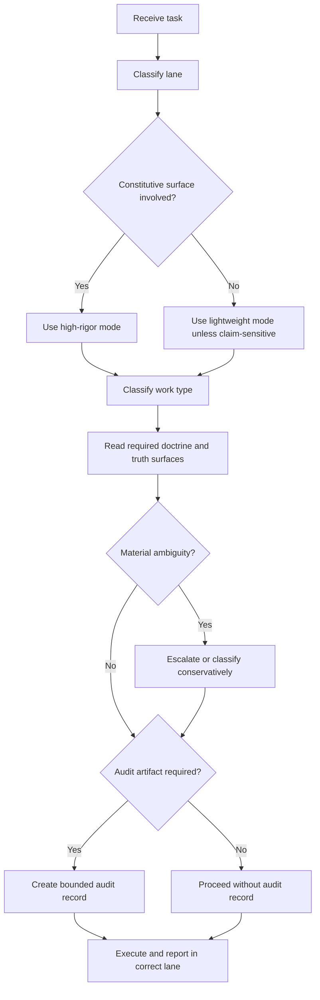

# HLF Agent Flow

This is a compact operator-facing flow guide derived from [AGENTS.md](../AGENTS.md), [docs/HLF_AGENT_OPERATING_PROTOCOL.md](./HLF_AGENT_OPERATING_PROTOCOL.md), and [docs/HLF_AUDIT_SYSTEM.md](./HLF_AUDIT_SYSTEM.md).

It is a helper surface, not the primary authority.

## 1. Forward Flow

1. Receive the task.
2. Classify the lane.
3. Decide whether constitutive surfaces are involved.
4. Classify the work type.
5. Choose lightweight mode or high-rigor mode.
6. Read the required doctrine, truth, and comparison surfaces.
7. Escalate if ambiguity materially affects architecture, scope, correctness, or claim lane.
8. Decide whether audit artifacts are required.
9. Execute.
10. Report the result in the correct lane.

## 2. Backward Verification Flow

1. Identify the task, lane, and work type.
2. Check whether required comparison or decision artifacts exist for high-risk work.
3. Check whether exclusions were stated.
4. Check whether current truth stayed separate from bridge and vision language.
5. Reject any result that silently upgraded maturity or flattened a constitutive surface without evidence.

## 3. Compact Decision Rules

- if doctrine or architecture is touched, use high-rigor mode
- if wording affects maturity claims, classify with [docs/HLF_CLAIM_LANES.md](./HLF_CLAIM_LANES.md)
- if a constitutive surface may be dismissed, compare before dismissing
- if ambiguity is materially outcome-changing, stop and escalate

## 4. Mermaid Flow

## 5. Quick Checklist

- lane classified
- work type classified
- constitutive check done if needed
- claim-lane check done if needed
- exclusions stated if any
- audit artifact created if required
- final language kept in the right truth lane
