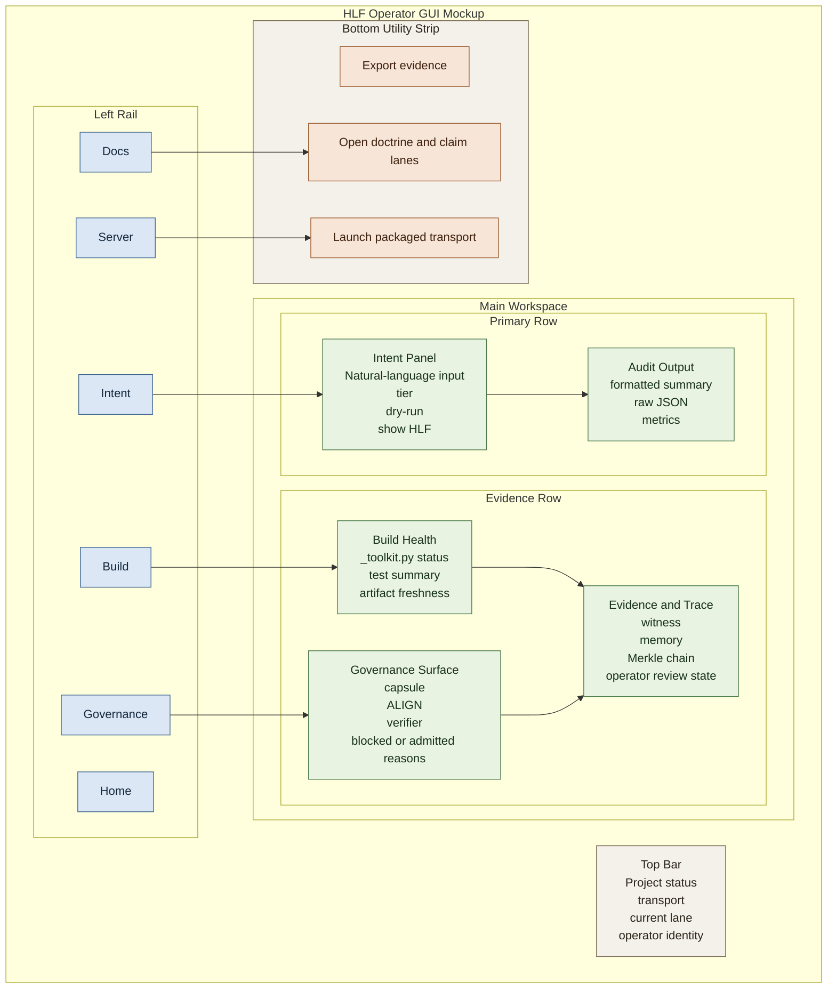
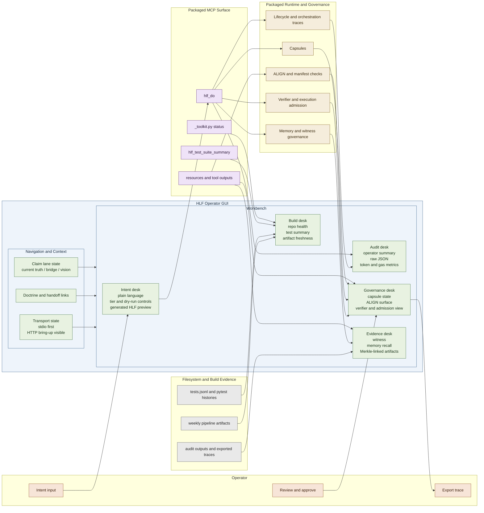
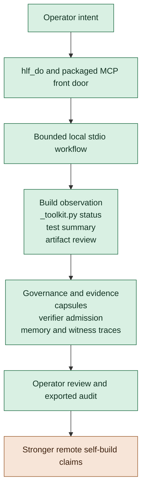

# HLF GUI Build Guide Draft

Status: rough draft design note only. This is not current packaged product truth and must be substantially refined before shipping.

Purpose:

- capture a future GUI direction without overstating current maturity
- keep the GUI tied to the packaged `hlf_mcp/` product surface
- preserve the repo's current recursive-build and governance boundaries

## Guardrails

- This draft must not be read as a claim that the GUI is implemented.
- This draft must not be used to promote self-hosting or autonomy claims beyond current proof.
- `stdio` remains the first credible recursive-build transport.
- `streamable-http` and other remote transports remain bring-up targets, not the center of the recursive-build story.
- All surfaced actions must map to packaged behavior under `hlf_mcp/`, `_toolkit.py`, and the current filesystem evidence outputs.

## Intended Role

This GUI is not a general-purpose IDE and not a generic dashboard.

Its job is to expose the current packaged HLF product surface in a way that helps two audiences:

1. operators building, validating, and recovering HLF now
2. future evaluators checking whether HLF is a governed, auditable interface worth trusting

It should center a bounded recursive build-assist loop made from packaged surfaces such as:

- `hlf_do`
- `_toolkit.py status`
- `hlf_test_suite_summary`
- witness, memory, and audit surfaces

## Accuracy Corrections For This Draft

This draft should now be read with the following current-truth constraints:

- the packaged MCP server is the current product front door, not the total HLF ontology
- the first credible recursive-build lane is local and bounded, centered on `stdio`
- HTTP health is implemented, but remote `streamable-http` self-build remains gated until end-to-end MCP initialization is proven repeatably in repo-owned workflow
- the GUI may expose packaged resources, tools, and evidence artifacts, but it must not imply that every constitutive HLF pillar is already fully restored
- routing, verifier, memory-governance, orchestration, and operator-trust surfaces may be shown as active packaged or bridge surfaces only where the repo already has corresponding code or named bridge specs

## Infographic Mockup

The diagram below is a bridge-lane wireframe mockup, not a claim that the GUI exists today.

### Mockup Reading Rule

- the left rail reflects task areas, not maturity levels
- the main workspace is centered on governed intent, evidence, and audit rather than generic productivity widgets
- the governance and trace panels are first-class because HLF should remain inspectable, not just operable
- the footer actions are constrained to packaged capabilities and repo-owned documentation surfaces

## Deeper System Mockup

The first mockup above is intentionally simple.

The diagram below is the more accurate systems-facing version for this repo's current direction: a GUI that acts as an operator shell over packaged MCP, build evidence, governance surfaces, and bridge-lane trust panels.

### Why This Is Closer To The Real Repo

- the GUI is shown as a shell over the packaged MCP and evidence surfaces, not as an independent product universe
- governance, verifier, lifecycle, and memory are visible as parallel trust-bearing systems rather than being collapsed into one generic output pane
- build evidence and operator review remain first-class because this repo is unusually concerned with proof, not just execution success
- claim-lane context is surfaced in navigation because wording discipline is part of operator safety here

## Recursive-Build Proof Ladder Mockup

This repo's visual language should also show that recursive-build claims are staged.

Reading rule:

- the ladder is not saying the repo is basic
- it is saying the repo earns stronger claims in sequence
- the lower rungs are already meaningful because they join intent, governance, evidence, and review inside one bounded workflow
- the top rung remains gated because transport presence alone is not enough proof

## Required Functional Areas

### 1. Recursive Build-Assist Loop

The GUI should make the current local build-assist loop visible and reviewable.

Required elements:

- Build health panel driven by `_toolkit.py status`
- intent-to-build flow view showing:
  - user intent
  - `hlf_do`
  - audit trail
  - test suite summary
  - witness, memory, and audit outputs
  - operator review
- evidence preservation dashboard for current build artifacts such as:
  - `~/.sovereign/mcp_metrics/tests.jsonl`
  - `pytest_last_run.json`
  - `pytest_history.jsonl`
  - `weekly_pipeline_latest.json`
  - `weekly_pipeline_history.jsonl`
- operator review state tracker with review status, notes, and immutable evidence references

### 2. `hlf_do` Front Door

The GUI should treat `hlf_do` as the natural-language entry point into governed action.

Required elements:

- free-text intent input
- packaged parameter controls:
  - tier
  - dry run
  - show generated HLF
- execution output panel showing:
  - raw JSON
  - formatted operator view
  - math metrics
- optional generated HLF viewer with semantic explanations of glyphs and tags

### 3. Transport and Server Control

The GUI must reflect packaged transport truth rather than inventing a stronger story.

Required elements:

- transport selector with `stdio` as the default
- explicit `HLF_PORT` requirement for HTTP transports
- warning language that remote transports are still bring-up targets
- server launch panel for packaged transport modes
- health test controls for HTTP transports
- model endpoint manager for explicit remote-direct endpoints only
- local model preference display that does not imply cloud defaults

### 4. Test and Regression Management

The GUI should expose the current packaged regression and evidence workflow.

Required elements:

- test runner widget for:
  - full suite
  - specific modules
  - last run summary
- regression summary panel backed by `hlf_test_suite_summary`
- weekly evidence pipeline trigger and latest-run preview

### 5. Governance and Audit Exposure

The GUI must surface why something was admitted, denied, or warned.

Required elements:

- Merkle chain explorer for recorded evidence artifacts
- ALIGN ledger monitor with rule ids, severities, and exportable logs
- intent capsule inspector with tier, gas, admitted effects, and blocked actions
- ethical governor log with blocking reason, article, and audit trail

### 6. Docker and Deployment Status

The GUI may surface packaged deployment state, but only as current packaged behavior.

Required elements:

- Docker status panel
- compose config preview
- image build status and digest view

### 7. Documentation and Messaging Alignment

The GUI should help users understand the right claim lane for what they are seeing.

Required elements:

- messaging ladder selector tied to audience type
- interactive vision map viewer
- doctrinal positioning panel using current repo language about HLF versus MCP

## UX Principles

### Hide complexity by default, not governance

- default view should be English intent and English audit output
- advanced views may reveal HLF source, AST, bytecode, and deeper evidence
- governance rationale must remain visible and inspectable

### Prefer transparent governance over black-box automation

- show every relevant constraint and audit reason
- do not hide why something was blocked
- make override and operator-review states explicit where policy permits

### Preserve recursive-build proof boundaries

- center `stdio`, `hlf_do`, `_toolkit.py status`, and `hlf_test_suite_summary`
- do not present remote transport availability as the main proof of recursive maturity

### Preserve machine-readable evidence

- every displayed artifact should map to a real file, tool output, or packaged resource
- export should prefer stable formats such as `.jsonl`, `.csv`, and similar structured outputs

## Example User Flow

1. Operator enters an intent.
2. GUI runs `hlf_do` with chosen packaged parameters.
3. GUI shows raw output, formatted audit output, and math metrics.
4. Operator checks current build health and regression summary.
5. GUI shows the resulting audit and evidence trail.
6. Operator marks the event reviewed and exports the trace if needed.

## Main Tabs

The current draft tab model is:

- Home
- Intent
- Build
- Governance
- Server
- Docs

Each tab should support:

- context-sensitive help tied to repo docs
- export for displayed evidence
- operator review tracking
- sync with filesystem-backed artifacts where possible

## Non-Goals

Do not include:

- claims that HLF is already fully self-hosting
- UI assumptions that `streamable-http` is the primary recursive-build transport
- cloud-model defaults not explicitly configured by the operator
- hidden governance or silent policy enforcement
- invented surfaces that are not grounded in `hlf_mcp/` and repo-owned supporting files

## Implementation Note

If this draft is ever turned into a real implementation plan, it should first be rewritten into:

1. current-truth surfaces
2. bridge surfaces
3. deferred vision surfaces

before any shipping claim is made.